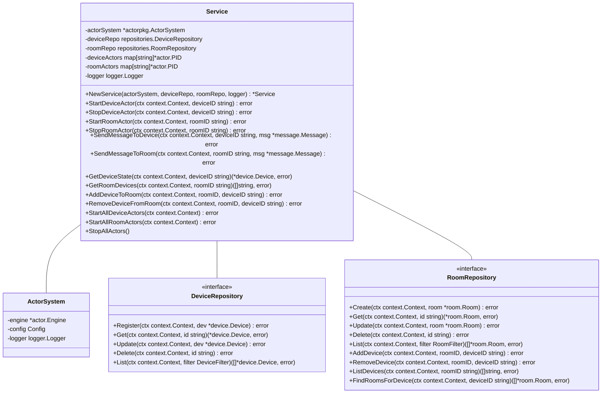

# 3. Actor System Components

## Overview

The actor system consists of several key components that work together to provide a robust and scalable concurrency model for the IoT system. This section describes these components and their relationships.

## Actor System Class Diagram

```mermaid
classDiagram
    class ActorSystem {
        -engine *actor.Engine
        -config Config
        -logger logger.Logger
        +NewActorSystem(config Config, log logger.Logger) *ActorSystem
        +SpawnDevice(deviceID string) (*actor.PID, error)
        +SpawnTwin(twinID string, devicePID *actor.PID) (*actor.PID, error)
        +SpawnRoom(roomID string) (*actor.PID, error)
        +SpawnPipeline(pipelineID string) (*actor.PID, error)
        +Stop()
    }
    
    class Config {
        +Address string
        +Port int
        +ClusterName string
    }
    
    class Actor {
        <<interface>>
        +Receive(ctx actor.Context)
    }
    
    class DeviceActor {
        -deviceID string
        -state *device.Device
        -logger logger.Logger
        +NewDeviceActor(deviceID string, log logger.Logger) *DeviceActor
        +Receive(ctx actor.Context)
        -handleStarted(ctx actor.Context)
        -handleStopped(ctx actor.Context)
        -handleMessage(ctx actor.Context, msg *message.Message)
        -handleUpdateState(ctx actor.Context, cmd *UpdateStateCommand)
        -handleGetState(ctx actor.Context, query *GetStateQuery)
    }
    
    class TwinActor {
        -twinID string
        -devicePID *actor.PID
        -logger logger.Logger
        +NewTwinActor(twinID string, devicePID *actor.PID, log logger.Logger) *TwinActor
        +Receive(ctx actor.Context)
        -handleStarted(ctx actor.Context)
        -handleStopped(ctx actor.Context)
        -handleMessage(ctx actor.Context, msg *message.Message)
    }
    
    class RoomActor {
        -roomID string
        -devices map[string]*actor.PID
        -logger logger.Logger
        +NewRoomActor(roomID string, log logger.Logger) *RoomActor
        +Receive(ctx actor.Context)
        -handleStarted(ctx actor.Context)
        -handleStopped(ctx actor.Context)
        -handleMessage(ctx actor.Context, msg *message.Message)
        -handleAddDevice(ctx actor.Context, cmd *AddDeviceCommand)
        -handleRemoveDevice(ctx actor.Context, cmd *RemoveDeviceCommand)
        -handleGetDevices(ctx actor.Context, query *GetDevicesQuery)
    }
    
    class PipelineActor {
        -pipelineID string
        -stages []*actor.PID
        -logger logger.Logger
        +NewPipelineActor(pipelineID string, log logger.Logger) *PipelineActor
        +Receive(ctx actor.Context)
        -handleStarted(ctx actor.Context)
        -handleStopped(ctx actor.Context)
        -handleMessage(ctx actor.Context, msg *message.Message)
        -handleAddStage(ctx actor.Context, cmd *AddStageCommand)
        -handleRemoveStage(ctx actor.Context, cmd *RemoveStageCommand)
        -handleGetStages(ctx actor.Context, query *GetStagesQuery)
    }
    
    ActorSystem -- Config
    Actor <|.. DeviceActor
    Actor <|.. TwinActor
    Actor <|.. RoomActor
    Actor <|.. PipelineActor
```

## Actor Service Class Diagram

## Message Types and Commands

```mermaid
classDiagram
    class Message {
        +ID string
        +Source string
        +Target string
        +Type Type
        +Payload []byte
        +ContentType string
        +Timestamp time.Time
        +Metadata map[string]string
        +ReplyTo *actor.PID
    }
    
    class Type {
        <<enumeration>>
        TypeTelemetry
        TypeCommand
        TypeEvent
        TypeResponse
    }
    
    class UpdateStateCommand {
        +State *device.Device
    }
    
    class UpdateStateResponse {
        +Success bool
    }
    
    class GetStateQuery {
    }
    
    class GetStateResponse {
        +State *device.Device
    }
    
    class AddDeviceCommand {
        +DeviceID string
        +DevicePID *actor.PID
    }
    
    class AddDeviceResponse {
        +Success bool
    }
    
    class RemoveDeviceCommand {
        +DeviceID string
    }
    
    class RemoveDeviceResponse {
        +Success bool
    }
    
    class GetDevicesQuery {
    }
    
    class GetDevicesResponse {
        +DeviceIDs []string
    }
    
    class AddStageCommand {
        +StageID string
        +StagePID *actor.PID
    }
    
    class AddStageResponse {
        +Success bool
    }
    
    class RemoveStageCommand {
        +StageID string
    }
    
    class RemoveStageResponse {
        +Success bool
    }
    
    class GetStagesQuery {
    }
    
    class GetStagesResponse {
        +StageIDs []string
    }
    
    Message -- Type
```

## Component Descriptions

### ActorSystem

The `ActorSystem` is the central coordinator that manages actor creation, messaging, and lifecycle. It provides methods for spawning different types of actors and stopping the entire actor system.

#### Key Methods:
- `NewActorSystem(config Config, log logger.Logger) *ActorSystem`: Creates a new actor system with the specified configuration.
- `SpawnDevice(deviceID string) (*actor.PID, error)`: Spawns a new device actor.
- `SpawnTwin(twinID string, devicePID *actor.PID) (*actor.PID, error)`: Spawns a new twin actor.
- `SpawnRoom(roomID string) (*actor.PID, error)`: Spawns a new room actor.
- `SpawnPipeline(pipelineID string) (*actor.PID, error)`: Spawns a new pipeline actor.
- `Stop()`: Stops the actor system and all actors.

### DeviceActor

The `DeviceActor` represents a physical IoT device and handles device-specific messages and state.

#### Key Methods:
- `NewDeviceActor(deviceID string, log logger.Logger) *DeviceActor`: Creates a new device actor.
- `Receive(ctx actor.Context)`: Handles messages sent to the actor.
- `handleStarted(ctx actor.Context)`: Handles the actor started event.
- `handleStopped(ctx actor.Context)`: Handles the actor stopped event.
- `handleMessage(ctx actor.Context, msg *message.Message)`: Handles messages sent to the device.
- `handleUpdateState(ctx actor.Context, cmd *UpdateStateCommand)`: Handles state update commands.
- `handleGetState(ctx actor.Context, query *GetStateQuery)`: Handles state queries.

### TwinActor

The `TwinActor` represents a digital twin of a physical device, providing a virtual representation for simulation and analysis.

#### Key Methods:
- `NewTwinActor(twinID string, devicePID *actor.PID, log logger.Logger) *TwinActor`: Creates a new twin actor.
- `Receive(ctx actor.Context)`: Handles messages sent to the actor.
- `handleStarted(ctx actor.Context)`: Handles the actor started event.
- `handleStopped(ctx actor.Context)`: Handles the actor stopped event.
- `handleMessage(ctx actor.Context, msg *message.Message)`: Handles messages sent to the twin.

### RoomActor

The `RoomActor` represents a physical or logical room containing multiple devices, enabling group operations.

#### Key Methods:
- `NewRoomActor(roomID string, log logger.Logger) *RoomActor`: Creates a new room actor.
- `Receive(ctx actor.Context)`: Handles messages sent to the actor.
- `handleStarted(ctx actor.Context)`: Handles the actor started event.
- `handleStopped(ctx actor.Context)`: Handles the actor stopped event.
- `handleMessage(ctx actor.Context, msg *message.Message)`: Handles messages sent to the room.
- `handleAddDevice(ctx actor.Context, cmd *AddDeviceCommand)`: Handles add device commands.
- `handleRemoveDevice(ctx actor.Context, cmd *RemoveDeviceCommand)`: Handles remove device commands.
- `handleGetDevices(ctx actor.Context, query *GetDevicesQuery)`: Handles get devices queries.

### PipelineActor

The `PipelineActor` represents a processing pipeline for data transformation and analysis.

#### Key Methods:
- `NewPipelineActor(pipelineID string, log logger.Logger) *PipelineActor`: Creates a new pipeline actor.
- `Receive(ctx actor.Context)`: Handles messages sent to the actor.
- `handleStarted(ctx actor.Context)`: Handles the actor started event.
- `handleStopped(ctx actor.Context)`: Handles the actor stopped event.
- `handleMessage(ctx actor.Context, msg *message.Message)`: Handles messages sent to the pipeline.
- `handleAddStage(ctx actor.Context, cmd *AddStageCommand)`: Handles add stage commands.
- `handleRemoveStage(ctx actor.Context, cmd *RemoveStageCommand)`: Handles remove stage commands.
- `handleGetStages(ctx actor.Context, query *GetStagesQuery)`: Handles get stages queries.

### Actor Service

The `Service` provides a high-level API for interacting with the actor system, managing actor lifecycle, and coordinating operations between actors and repositories.

#### Key Methods:
- `NewService(actorSystem, deviceRepo, roomRepo, logger) *Service`: Creates a new actor service.
- `StartDeviceActor(ctx context.Context, deviceID string) error`: Starts an actor for a device.
- `StopDeviceActor(ctx context.Context, deviceID string) error`: Stops an actor for a device.
- `StartRoomActor(ctx context.Context, roomID string) error`: Starts an actor for a room.
- `StopRoomActor(ctx context.Context, roomID string) error`: Stops an actor for a room.
- `SendMessageToDevice(ctx context.Context, deviceID string, msg *message.Message) error`: Sends a message to a device actor.
- `SendMessageToRoom(ctx context.Context, roomID string, msg *message.Message) error`: Sends a message to a room actor.
- `GetDeviceState(ctx context.Context, deviceID string) (*device.Device, error)`: Gets the state of a device actor.
- `GetRoomDevices(ctx context.Context, roomID string) ([]string, error)`: Gets the devices in a room actor.
- `AddDeviceToRoom(ctx context.Context, roomID, deviceID string) error`: Adds a device to a room actor.
- `RemoveDeviceFromRoom(ctx context.Context, roomID, deviceID string) error`: Removes a device from a room actor.
- `StartAllDeviceActors(ctx context.Context) error`: Starts actors for all devices.
- `StartAllRoomActors(ctx context.Context) error`: Starts actors for all rooms.
- `StopAllActors()`: Stops all actors.

## Message Types

The system uses several types of messages for communication between actors:

### Message

The `Message` struct represents a message that can be sent between actors. It includes fields for the message ID, source, target, type, payload, and metadata.

### Commands and Queries

The system uses a command-query separation pattern for actor communication:

- **Commands**: Represent operations that change state, such as `UpdateStateCommand`, `AddDeviceCommand`, and `RemoveDeviceCommand`.
- **Queries**: Represent operations that retrieve state without changing it, such as `GetStateQuery`, `GetDevicesQuery`, and `GetStagesQuery`.
- **Responses**: Represent the results of commands and queries, such as `UpdateStateResponse`, `AddDeviceResponse`, and `GetStateResponse`.

## Component Interactions

The components interact through message passing, with the actor system coordinating communication between actors. The actor service provides a high-level API for interacting with the actor system, managing actor lifecycle, and coordinating operations between actors and repositories.

For example, when a device sends telemetry data, the following interactions occur:

1. The message broker receives the telemetry data and forwards it to the actor service.
2. The actor service identifies the target device actor and sends the message to it.
3. The device actor processes the telemetry data, updates its state, and may forward the data to other actors (e.g., twin actors or room actors).
4. If necessary, the device actor updates the device state in the repository.

These interactions are all asynchronous and message-driven, allowing the system to handle high volumes of messages efficiently.
