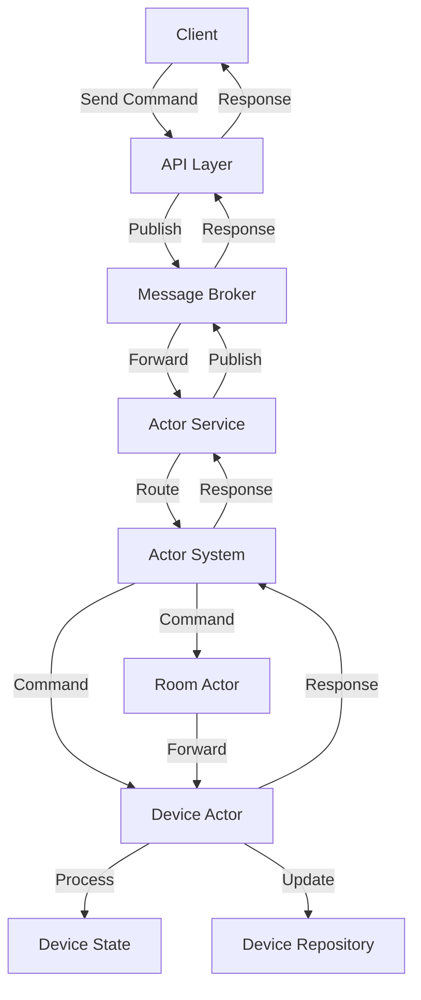
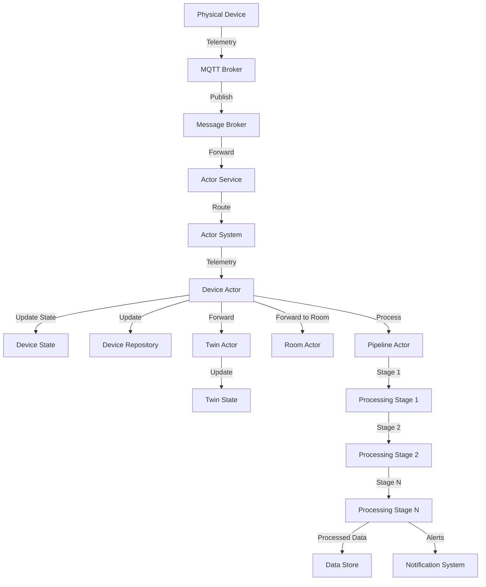
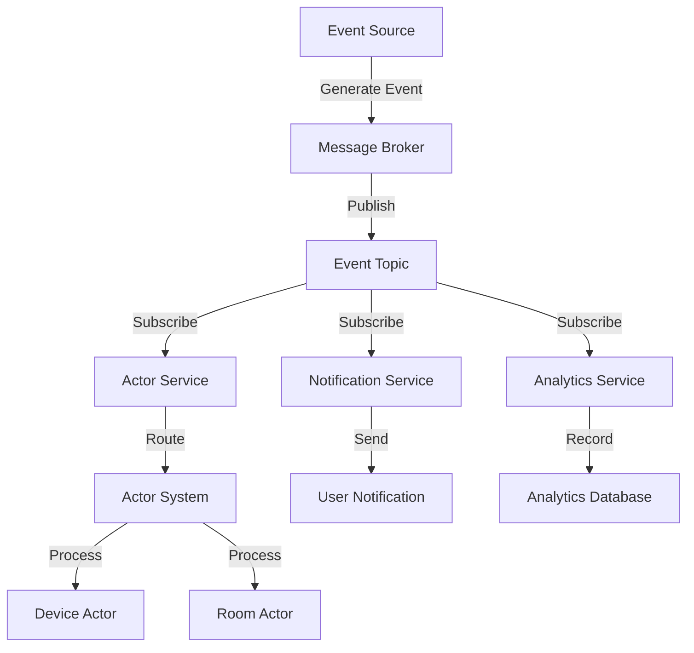

# 7. Data Flow

## Overview

This section describes how data flows through the actor-based IoT system, including command processing, telemetry processing, and event handling. Understanding these data flows is essential for designing, implementing, and troubleshooting the system.

## Command Processing Flow

Commands are instructions sent to devices to perform specific actions, such as turning on a light or adjusting a thermostat. The following diagram illustrates the flow of command processing in the system:



### Command Processing Steps:

1. **Command Initiation**: A client (e.g., mobile app, web interface) sends a command to the API layer.
2. **Command Publication**: The API layer publishes the command to the message broker.
3. **Command Routing**: The message broker forwards the command to the actor service.
4. **Actor Selection**: The actor service identifies the target actor (device or room) and routes the command to it.
5. **Command Processing**: The actor processes the command, which may involve:
   - Validating the command
   - Updating the actor's state
   - Persisting the state change to the repository
   - Forwarding the command to other actors (e.g., room actor forwarding to device actors)
6. **Response Generation**: The actor generates a response indicating the result of the command.
7. **Response Routing**: The response is routed back through the actor system, actor service, and message broker to the API layer.
8. **Response Delivery**: The API layer delivers the response to the client.

### Command Message Structure:

```json
{
  "id": "cmd-123456",
  "source": "mobile-app-1",
  "target": "device-1",
  "type": "command",
  "payload": {
    "command": "set_temperature",
    "parameters": {
      "temperature": 22.5,
      "unit": "celsius"
    }
  },
  "timestamp": "2023-06-15T10:30:00Z",
  "metadata": {
    "user_id": "user-123",
    "priority": "high"
  }
}
```

## Telemetry Processing Flow

Telemetry is data sent from devices to the system, such as sensor readings, status updates, or diagnostic information. The following diagram illustrates the flow of telemetry processing in the system:



### Telemetry Processing Steps:

1. **Telemetry Generation**: A physical device generates telemetry data.
2. **Telemetry Publication**: The device publishes the telemetry data to the MQTT broker.
3. **Telemetry Routing**: The MQTT broker forwards the telemetry data to the message broker, which routes it to the actor service.
4. **Actor Selection**: The actor service identifies the target device actor and routes the telemetry data to it.
5. **State Update**: The device actor updates its state based on the telemetry data.
6. **State Persistence**: The device actor persists the state change to the device repository.
7. **Twin Update**: The device actor forwards the telemetry data to the corresponding twin actor, which updates its state.
8. **Room Notification**: The device actor notifies the room actor of the telemetry data.
9. **Pipeline Processing**: The device actor forwards the telemetry data to the pipeline actor for processing.
10. **Data Processing**: The pipeline actor processes the telemetry data through a series of stages.
11. **Data Storage**: The processed data is stored in a data store for historical analysis.
12. **Alert Generation**: If the telemetry data triggers any alerts, notifications are sent to the appropriate systems or users.

### Telemetry Message Structure:

```json
{
  "id": "tel-123456",
  "source": "device-1",
  "target": "system",
  "type": "telemetry",
  "payload": {
    "temperature": 22.5,
    "humidity": 45.2,
    "battery": 78
  },
  "timestamp": "2023-06-15T10:30:00Z",
  "metadata": {
    "device_type": "sensor",
    "location": "living_room"
  }
}
```

## Event Processing Flow

Events are notifications of significant occurrences in the system, such as device state changes, user actions, or system alerts. The following diagram illustrates the flow of event processing in the system:



### Event Processing Steps:

1. **Event Generation**: An event source (e.g., device, user action, system) generates an event.
2. **Event Publication**: The event is published to the message broker.
3. **Event Distribution**: The message broker distributes the event to subscribers of the relevant topic.
4. **Actor Processing**: The actor service routes the event to the appropriate actors for processing.
5. **Notification**: The notification service sends notifications to users or other systems based on the event.
6. **Analytics**: The analytics service records the event for analysis and reporting.

### Event Message Structure:

```json
{
  "id": "evt-123456",
  "source": "device-1",
  "type": "event",
  "event_type": "state_change",
  "payload": {
    "previous_state": "offline",
    "current_state": "online",
    "reason": "power_restored"
  },
  "timestamp": "2023-06-15T10:30:00Z",
  "metadata": {
    "device_type": "sensor",
    "location": "living_room"
  }
}
```

## Data Transformation

As data flows through the system, it undergoes various transformations to adapt it to different contexts and requirements. The following diagram illustrates the data transformation process:

```mermaid
flowchart LR
    RawData["Raw Data"] -->|"Parsing"| ParsedData["Parsed Data"]
    ParsedData -->|"Validation"| ValidatedData["Validated Data"]
    ValidatedData -->|"Enrichment"| EnrichedData["Enriched Data"]
    EnrichedData -->|"Normalization"| NormalizedData["Normalized Data"]
    NormalizedData -->|"Aggregation"| AggregatedData["Aggregated Data"]
    AggregatedData -->|"Formatting"| FormattedData["Formatted Data"]
```



### Data Transformation Steps:

1. **Parsing**: Converting raw data (e.g., JSON, binary) into structured data that can be processed by the system.
2. **Validation**: Checking that the data conforms to expected formats, ranges, and constraints.
3. **Enrichment**: Adding additional information to the data, such as metadata, context, or derived values.
4. **Normalization**: Converting data to standard units, formats, or representations for consistent processing.
5. **Aggregation**: Combining multiple data points into summary statistics or higher-level representations.
6. **Formatting**: Converting the processed data into the format required by the target system or component.

## Data Storage

The system stores data in various repositories for different purposes:

1. **Device Repository**: Stores device information, including:
   - Device ID, name, and type
   - Current status and state
   - Metadata and configuration
   - Creation and update timestamps

2. **Room Repository**: Stores room information, including:
   - Room ID, name, and type
   - List of devices in the room
   - Metadata and configuration
   - Creation and update timestamps

3. **Message Repository**: Stores message history, including:
   - Message ID, source, and target
   - Message type and payload
   - Timestamp and metadata
   - Processing status and result

4. **Telemetry Repository**: Stores historical telemetry data, including:
   - Device ID and timestamp
   - Telemetry values
   - Metadata and context
   - Aggregated statistics

## Data Access Patterns

The system uses various data access patterns to retrieve and manipulate data:

1. **Direct Access**: Retrieving a specific entity by ID, such as a device or room.
2. **Filtered Query**: Retrieving entities that match specific criteria, such as devices of a certain type or rooms with specific metadata.
3. **Aggregation Query**: Retrieving aggregated data, such as average temperature readings over time.
4. **Time Series Query**: Retrieving data points over a time range, such as telemetry readings for a specific period.
5. **Relationship Query**: Retrieving entities based on their relationships, such as devices in a specific room.

## Data Flow Optimization

To optimize data flow through the system, the following techniques are employed:

1. **Caching**: Frequently accessed data is cached to reduce database load and improve response times.
2. **Batching**: Multiple data operations are batched together to reduce network overhead and improve throughput.
3. **Compression**: Large data payloads are compressed to reduce bandwidth usage and storage requirements.
4. **Indexing**: Data is indexed to speed up query performance for common access patterns.
5. **Partitioning**: Data is partitioned based on access patterns to improve scalability and performance.
6. **Asynchronous Processing**: Non-critical data operations are performed asynchronously to improve responsiveness.

## Data Flow Monitoring

Monitoring data flow is essential for detecting and diagnosing issues. The following metrics are collected:

1. **Throughput**: Number of messages or data points processed per second.
2. **Latency**: Time taken for data to flow through each stage of processing.
3. **Error Rate**: Number of errors encountered during data processing.
4. **Queue Depth**: Number of messages waiting to be processed at each stage.
5. **Processing Time**: Time taken to process each type of message or data point.
6. **Storage Usage**: Amount of storage used for each type of data.

## Best Practices for Data Flow

1. **Schema Design**: Design data schemas to be flexible, extensible, and backward compatible.
2. **Validation**: Validate data at each stage of processing to catch errors early.
3. **Error Handling**: Implement proper error handling and recovery mechanisms for data processing failures.
4. **Logging**: Log data flow events for debugging and auditing purposes.
5. **Monitoring**: Monitor data flow metrics to detect and diagnose issues.
6. **Testing**: Test data flow under various conditions, including high load and error scenarios.
7. **Documentation**: Document data schemas, transformations, and access patterns.
8. **Security**: Implement appropriate security measures to protect sensitive data.
9. **Compliance**: Ensure data handling complies with relevant regulations and policies.
10. **Performance**: Optimize data flow for performance, scalability, and resource efficiency.
