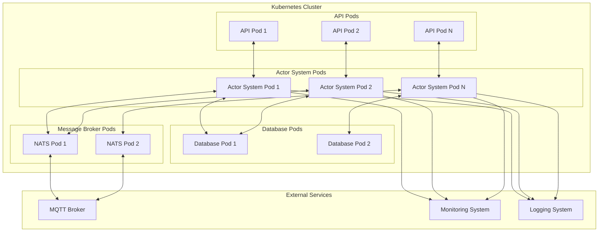
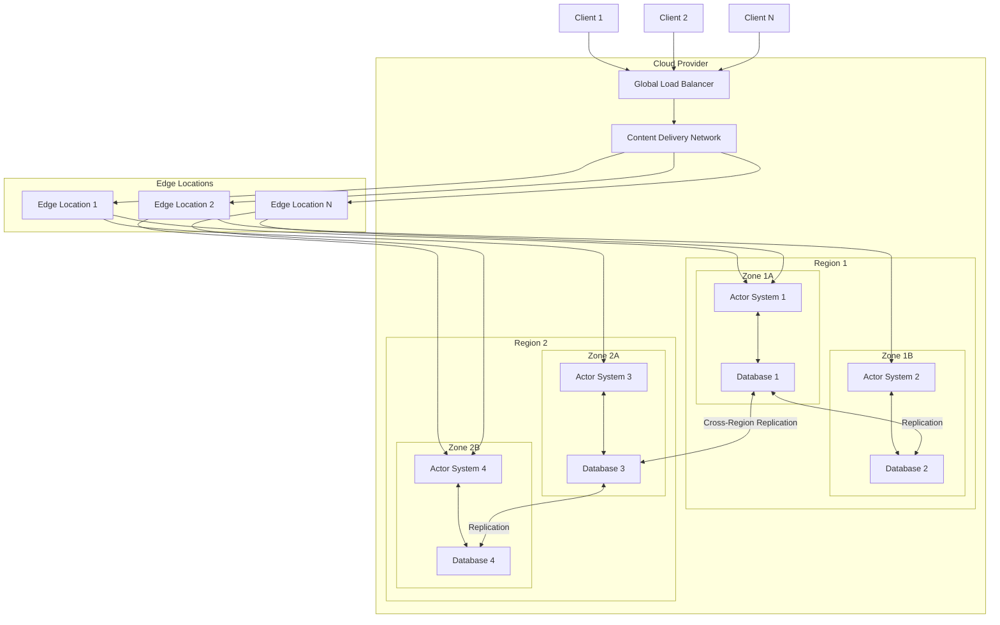
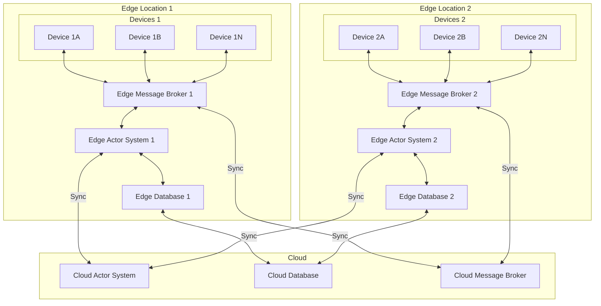

# 10. Deployment Architecture

## Overview

This section describes the deployment architecture for the actor-based IoT system, including containerization, cloud deployment, and edge computing strategies. A well-designed deployment architecture is essential for ensuring the system's reliability, scalability, and performance in production environments.

## Containerized Deployment

The system is designed to be deployed in containers using Kubernetes for orchestration. The following diagram illustrates the containerized deployment architecture:



### Container Components

1. **API Pods**: Host the REST and MQTT APIs that external clients use to interact with the system.
2. **Actor System Pods**: Host the actor system instances that manage device, room, and other actors.
3. **Database Pods**: Host the databases used for persistent storage of device state, room configurations, and other data.
4. **Message Broker Pods**: Host the NATS message broker instances used for communication between components.

### Kubernetes Resources

The system uses the following Kubernetes resources:

1. **Deployments**: Define the desired state for the pods, including the number of replicas, container images, and resource requirements.
2. **Services**: Provide stable network endpoints for accessing the pods.
3. **ConfigMaps**: Store configuration data that can be consumed by the pods.
4. **Secrets**: Store sensitive data such as API keys and credentials.
5. **StatefulSets**: Used for stateful components like databases that require stable network identities and persistent storage.
6. **PersistentVolumes**: Provide persistent storage for stateful components.
7. **HorizontalPodAutoscalers**: Automatically scale the number of pod replicas based on CPU utilization or custom metrics.

## Cloud Deployment

The system can be deployed in cloud environments, leveraging cloud-native services for improved reliability, scalability, and manageability. The following diagram illustrates the cloud deployment architecture:



### Cloud Services

The system leverages the following cloud services:

1. **Compute Services**: Host the actor system instances, APIs, and other components.
2. **Managed Kubernetes**: Provide managed Kubernetes clusters for containerized deployment.
3. **Managed Databases**: Provide managed database services for persistent storage.
4. **Message Queue Services**: Provide managed message queue services for communication between components.
5. **Load Balancers**: Distribute traffic across instances and regions.
6. **Content Delivery Networks**: Cache static content and API responses for improved performance.
7. **Identity and Access Management**: Manage authentication and authorization for system components.
8. **Monitoring and Logging**: Provide monitoring and logging services for system observability.
9. **Auto Scaling**: Automatically scale resources based on demand.

## Edge Computing

For IoT scenarios with low-latency requirements or limited connectivity, the system can be deployed using an edge computing architecture. The following diagram illustrates this approach:



### Edge Components

1. **Edge Actor System**: A lightweight version of the actor system that runs on edge devices or gateways.
2. **Edge Database**: A local database for storing device state and other data at the edge.
3. **Edge Message Broker**: A local message broker for communication between components at the edge.

### Edge-Cloud Synchronization

The edge and cloud components synchronize data using the following mechanisms:

1. **State Synchronization**: Device and room state is synchronized between edge and cloud databases.
2. **Message Forwarding**: Messages that need to be processed in the cloud are forwarded from edge to cloud message brokers.
3. **Command Distribution**: Commands from the cloud are distributed to the appropriate edge locations.
4. **Conflict Resolution**: Conflicts between edge and cloud state are resolved using appropriate strategies (e.g., last-writer-wins, merge).

## Deployment Configurations

The system supports different deployment configurations based on the specific requirements of the deployment environment:

### Development Configuration

- Single-node deployment for development and testing
- In-memory databases for simplicity
- Local message broker
- Minimal resource requirements

### Testing Configuration

- Multi-node deployment for integration and performance testing
- Persistent databases with test data
- Distributed message broker
- Realistic resource allocation

### Production Configuration

- Fully distributed deployment across multiple zones and regions
- High-availability databases with replication
- Clustered message broker with redundancy
- Appropriate resource allocation based on expected load
- Monitoring, logging, and alerting enabled

## Deployment Process

The deployment process follows these steps:

1. **Build**: Build container images for all components.
2. **Test**: Run automated tests on the built images.
3. **Push**: Push the images to a container registry.
4. **Deploy**: Deploy the images to the target environment using Kubernetes manifests or Helm charts.
5. **Verify**: Verify the deployment by running health checks and smoke tests.
6. **Monitor**: Monitor the deployment for any issues.

## Infrastructure as Code

The deployment infrastructure is defined as code using tools like Terraform, Kubernetes YAML manifests, or Helm charts. This approach provides several benefits:

1. **Reproducibility**: Deployments can be reproduced consistently across environments.
2. **Version Control**: Infrastructure changes can be tracked in version control.
3. **Automation**: Deployments can be automated using CI/CD pipelines.
4. **Documentation**: The infrastructure is self-documenting through the code.

## Example: Kubernetes Deployment

The following example shows a Kubernetes deployment for an actor system pod:

```yaml
apiVersion: apps/v1
kind: Deployment
metadata:
  name: actor-system
  labels:
    app: actor-system
spec:
  replicas: 3
  selector:
    matchLabels:
      app: actor-system
  template:
    metadata:
      labels:
        app: actor-system
    spec:
      containers:
      - name: actor-system
        image: iot-system/actor-system:latest
        ports:
        - containerPort: 8000
        env:
        - name: ACTOR_SYSTEM_ADDRESS
          valueFrom:
            fieldRef:
              fieldPath: status.podIP
        - name: ACTOR_SYSTEM_PORT
          value: "8000"
        - name: ACTOR_SYSTEM_CLUSTER_NAME
          value: "iot-cluster"
        - name: NATS_URL
          value: "nats://nats-service:4222"
        - name: DATABASE_URL
          valueFrom:
            secretKeyRef:
              name: database-credentials
              key: url
        resources:
          requests:
            cpu: "500m"
            memory: "512Mi"
          limits:
            cpu: "2000m"
            memory: "2Gi"
        livenessProbe:
          httpGet:
            path: /health
            port: 8000
          initialDelaySeconds: 30
          periodSeconds: 10
        readinessProbe:
          httpGet:
            path: /ready
            port: 8000
          initialDelaySeconds: 5
          periodSeconds: 5
```

## Deployment Considerations

### Resource Requirements

The resource requirements for the system depend on the expected load and performance requirements:

| Component | CPU (per instance) | Memory (per instance) | Disk | Instances |
|-----------|-------------------|----------------------|------|-----------|
| Actor System | 2-4 cores | 2-8 GB | 20 GB | 3+ |
| Database | 2-8 cores | 4-16 GB | 100+ GB | 2+ |
| Message Broker | 2-4 cores | 2-8 GB | 20 GB | 3+ |
| API | 1-2 cores | 1-4 GB | 10 GB | 2+ |

### Network Requirements

The system has the following network requirements:

1. **Internal Communication**: Low-latency, high-bandwidth network for communication between components.
2. **External Communication**: Secure, reliable network for communication with external systems and clients.
3. **Cross-Region Communication**: Reliable network for communication between regions.
4. **Edge-Cloud Communication**: Potentially intermittent network for communication between edge and cloud.

### Security Requirements

The system has the following security requirements:

1. **Authentication**: All components must authenticate with each other.
2. **Authorization**: Access to resources must be controlled based on roles and permissions.
3. **Encryption**: All communication must be encrypted in transit.
4. **Secrets Management**: Sensitive information must be securely managed.
5. **Network Security**: Network access must be restricted using firewalls and security groups.

## Best Practices for Deployment

1. **Use Infrastructure as Code**: Define all infrastructure as code for reproducibility and version control.
2. **Implement CI/CD**: Automate the build, test, and deployment process.
3. **Monitor and Alert**: Implement comprehensive monitoring and alerting.
4. **Plan for Scaling**: Design the deployment to scale horizontally as load increases.
5. **Implement High Availability**: Deploy components across multiple availability zones for high availability.
6. **Secure the Deployment**: Implement appropriate security measures at all levels.
7. **Document the Deployment**: Document the deployment architecture, process, and requirements.
8. **Test Disaster Recovery**: Regularly test disaster recovery procedures.
9. **Optimize Resource Usage**: Monitor and optimize resource usage to control costs.
10. **Keep Dependencies Updated**: Regularly update dependencies to address security vulnerabilities and benefit from improvements.

## Conclusion

A well-designed deployment architecture is essential for the successful operation of the actor-based IoT system in production environments. By leveraging containerization, cloud services, and edge computing as appropriate, the system can achieve the required reliability, scalability, and performance while maintaining manageability and cost-effectiveness.
