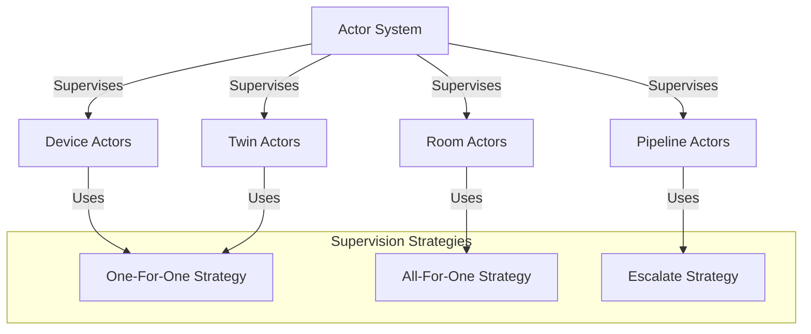

# 8. Error Handling and Recovery

## Overview

This section describes how errors are handled and recovered from in the actor-based IoT system. Proper error handling is crucial for building a resilient system that can continue operating despite failures.

## Actor Supervision Hierarchy

Actors in the system are organized in a supervision hierarchy, where parent actors supervise their child actors and handle their failures. The following diagram illustrates this hierarchy:



## Supervision Strategies

The system uses different supervision strategies depending on the type of actor and the nature of the failure:

1. **One-For-One Strategy**: When a child actor fails, only that actor is restarted. This strategy is used for independent actors like device actors, where a failure in one actor should not affect others.

2. **All-For-One Strategy**: When a child actor fails, all sibling actors are restarted. This strategy is used for interdependent actors like room actors, where a failure in one actor may affect the consistency of others.

3. **Escalate Strategy**: When a child actor fails, the failure is escalated to the parent actor. This strategy is used for critical actors like pipeline actors, where a failure may require higher-level intervention.

## Error Recovery Flow

The following diagram illustrates the flow of error recovery in the system:

```mermaid
sequenceDiagram
    participant Client
    participant ActorSystem
    participant Supervisor
    participant Actor
    
    Client->>Actor: Send Message
    Actor->>Actor: Process Message
    Actor->>Actor: Error Occurs
    Actor->>Supervisor: Report Error
    
    alt One-For-One Strategy
        Supervisor->>Actor: Restart
        Actor->>Actor: Initialize State
        Actor-->>Supervisor: Ready
    else All-For-One Strategy
        Supervisor->>Supervisor: Restart All Children
        Supervisor-->>ActorSystem: All Children Restarted
    else Escalate Strategy
        Supervisor->>ActorSystem: Escalate Error
        ActorSystem->>ActorSystem: Apply System-Level Recovery
    end
    
    Supervisor-->>Client: Error Handled
```

## Error Types

The system handles various types of errors:

1. **Validation Errors**: Errors that occur when input data fails validation, such as invalid commands or malformed messages.

2. **Business Logic Errors**: Errors that occur when business rules are violated, such as attempting to perform an operation on a device that is offline.

3. **Technical Errors**: Errors that occur due to technical issues, such as network failures, database errors, or resource exhaustion.

4. **System Errors**: Errors that occur at the system level, such as configuration errors, initialization failures, or critical resource failures.

## Error Handling Strategies

The system uses different strategies for handling errors:

1. **Retry**: For transient errors, the operation is retried with an appropriate backoff strategy.

2. **Circuit Breaking**: For persistent errors, a circuit breaker is used to prevent cascading failures.

3. **Fallback**: For non-critical operations, a fallback mechanism is used to provide degraded functionality.

4. **Logging and Monitoring**: All errors are logged and monitored to detect patterns and trends.

5. **Notification**: Critical errors trigger notifications to operators or administrators.

## Error Handling in Actors

Actors handle errors in their message processing logic:

```go
func (a *DeviceActor) handleMessage(ctx actor.Context, msg *message.Message) {
    a.logger.Info("Received message", "message_id", msg.ID, "message_type", msg.Type)

    // Process message based on type
    switch msg.Type {
    case "command":
        // Handle command message
        err := a.handleCommandMessage(ctx, msg)
        if err != nil {
            a.handleError(ctx, msg, err)
        }
    case "event":
        // Handle event message
        err := a.handleEventMessage(ctx, msg)
        if err != nil {
            a.handleError(ctx, msg, err)
        }
    case "telemetry":
        // Handle telemetry message
        err := a.handleTelemetryMessage(ctx, msg)
        if err != nil {
            a.handleError(ctx, msg, err)
        }
    default:
        a.logger.Warn("Unknown message type", "type", msg.Type)
        a.handleError(ctx, msg, errbuilder.NewErrBuilder().
            WithMsg(fmt.Sprintf("Unknown message type: %s", msg.Type)).
            WithCode(errbuilder.CodeInvalidArgument))
    }
}

func (a *DeviceActor) handleError(ctx actor.Context, msg *message.Message, err error) {
    // Log the error
    a.logger.Error("Error handling message", 
        "message_id", msg.ID, 
        "message_type", msg.Type, 
        "error", err)

    // Create error response
    response := &message.Message{
        ID:      uuid.New().String(),
        Type:    "response",
        Source:  a.deviceID,
        Target:  msg.Source,
        Payload: []byte(fmt.Sprintf(`{"error": "%s"}`, err.Error())),
    }

    // Send response to sender
    if msg.ReplyTo != nil {
        ctx.Send(msg.ReplyTo, response)
    }

    // Update actor state if necessary
    if a.state != nil {
        a.state.LastError = err.Error()
        a.state.LastErrorTime = time.Now()
        a.state.ErrorCount++
    }

    // Determine if the error is recoverable
    if errbuilder.IsRecoverable(err) {
        // For recoverable errors, retry the operation if appropriate
        if a.shouldRetry(msg, err) {
            a.scheduleRetry(ctx, msg)
        }
    } else {
        // For non-recoverable errors, panic to trigger supervision
        panic(err)
    }
}

func (a *DeviceActor) shouldRetry(msg *message.Message, err error) bool {
    // Determine if the message should be retried based on:
    // - Message type and importance
    // - Error type and severity
    // - Current retry count
    // - System load and backpressure
    return false // Default implementation
}

func (a *DeviceActor) scheduleRetry(ctx actor.Context, msg *message.Message) {
    // Schedule a retry of the message with appropriate backoff
    // This could use a timer or a dedicated retry actor
}
```

## Error Propagation

Errors are propagated through the system in a controlled manner:

1. **Local Handling**: Errors are first handled locally by the actor that encounters them.

2. **Supervision**: If the actor cannot handle the error, it is propagated to its supervisor.

3. **Escalation**: If the supervisor cannot handle the error, it is escalated up the supervision hierarchy.

4. **System-Level Handling**: If the error reaches the top of the supervision hierarchy, it is handled at the system level.

## Error Reporting

Errors are reported through various channels:

1. **Logs**: All errors are logged with appropriate context and severity.

2. **Metrics**: Error counts and rates are tracked as metrics for monitoring and alerting.

3. **Events**: Significant errors generate events that can be consumed by other systems.

4. **Notifications**: Critical errors trigger notifications to operators or administrators.

## Error Recovery Mechanisms

The system uses various mechanisms for recovering from errors:

1. **Actor Restart**: Failed actors are restarted with a clean state.

2. **State Recovery**: Actor state is recovered from persistent storage or reconstructed from events.

3. **Message Replay**: Failed messages are replayed after the actor has been restarted.

4. **Graceful Degradation**: Non-critical functionality is disabled to maintain core functionality.

5. **Circuit Breaking**: Failed operations are prevented from being attempted until the underlying issue is resolved.

## Best Practices for Error Handling

1. **Use Structured Errors**: Use the `errbuilder` package to create structured errors with detailed information.

2. **Classify Errors**: Classify errors by type, severity, and recoverability to enable appropriate handling.

3. **Provide Context**: Include relevant context in error messages and logs to aid in diagnosis.

4. **Implement Retry Logic**: Implement appropriate retry logic for transient errors.

5. **Use Circuit Breakers**: Use circuit breakers to prevent cascading failures.

6. **Log Appropriately**: Log errors with appropriate severity and context.

7. **Monitor Error Rates**: Monitor error rates and patterns to detect systemic issues.

8. **Test Error Handling**: Test error handling code to ensure it works as expected.

9. **Document Error Handling**: Document error handling strategies and recovery procedures.

10. **Review and Improve**: Regularly review error logs and improve error handling based on real-world experience.

## Example: Error Handling with errbuilder

The system uses the `errbuilder` package to create structured errors with detailed information:

```go
// Create a new error
err := errbuilder.NewErrBuilder().
    WithMsg("Failed to process command").
    WithCode(errbuilder.CodeInvalidArgument).
    WithMetadata(map[string]string{
        "device_id": deviceID,
        "command": command,
    }).
    WithCause(originalErr)

// Check error code
if errbuilder.CodeOf(err) == errbuilder.CodeInvalidArgument {
    // Handle invalid argument error
}

// Extract metadata
metadata := errbuilder.MetadataOf(err)
deviceID := metadata["device_id"]

// Get original cause
cause := errbuilder.CauseOf(err)
```

## Conclusion

Effective error handling is essential for building a resilient actor-based IoT system. By implementing proper supervision hierarchies, error handling strategies, and recovery mechanisms, the system can continue operating despite failures and provide a reliable service to users.
