# 14. Future Enhancements

## Overview

This section outlines potential future enhancements for the actor-based IoT system. These enhancements aim to improve the system's functionality, performance, scalability, and reliability based on emerging technologies, evolving requirements, and lessons learned from the current implementation.

## Roadmap

The following roadmap outlines the planned enhancements for the actor system:

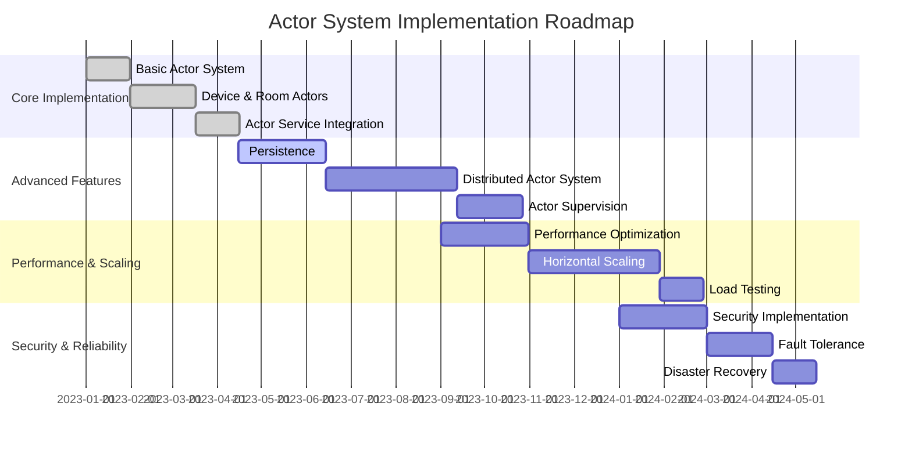

## Architecture Evolution

The architecture of the actor system will evolve over time to meet changing requirements and leverage new technologies:

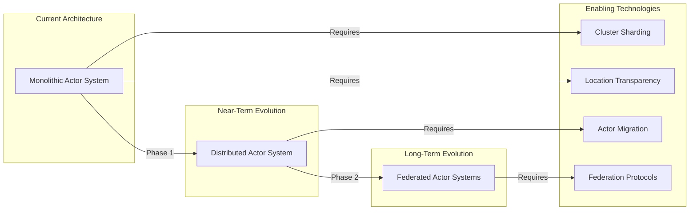

## Persistence and State Management

### Event Sourcing

Implement event sourcing for actor state management, allowing actors to rebuild their state from a sequence of events:

```mermaid
sequenceDiagram
    participant Client
    participant Actor
    participant EventStore
    
    Client->>Actor: Command
    Actor->>Actor: Validate Command
    Actor->>Actor: Generate Event
    Actor->>EventStore: Store Event
    EventStore-->>Actor: Event Stored
    Actor->>Actor: Apply Event to State
    Actor-->>Client: Command Result
    
    Client->>Actor: Query
    Actor-->>Client: Current State
    
    Note over Actor: Actor Restart
    Actor->>EventStore: Load Events
    EventStore-->>Actor: Events
    Actor->>Actor: Replay Events
    Actor->>Actor: Rebuild State
```

### Snapshotting

Implement snapshotting to optimize actor state recovery:

```mermaid
sequenceDiagram
    participant Actor
    participant EventStore
    participant SnapshotStore
    
    Note over Actor: Actor Processing Events
    
    Actor->>Actor: Check Snapshot Criteria
    Actor->>Actor: Create Snapshot
    Actor->>SnapshotStore: Store Snapshot
    SnapshotStore-->>Actor: Snapshot Stored
    
    Note over Actor: Actor Restart
    
    Actor->>SnapshotStore: Load Latest Snapshot
    SnapshotStore-->>Actor: Snapshot
    Actor->>Actor: Apply Snapshot
    Actor->>EventStore: Load Events After Snapshot
    EventStore-->>Actor: Events
    Actor->>Actor: Replay Events
    Actor->>Actor: Rebuild State
```

## Distributed Actor System

### Cluster Sharding

Implement cluster sharding to distribute actors across nodes:

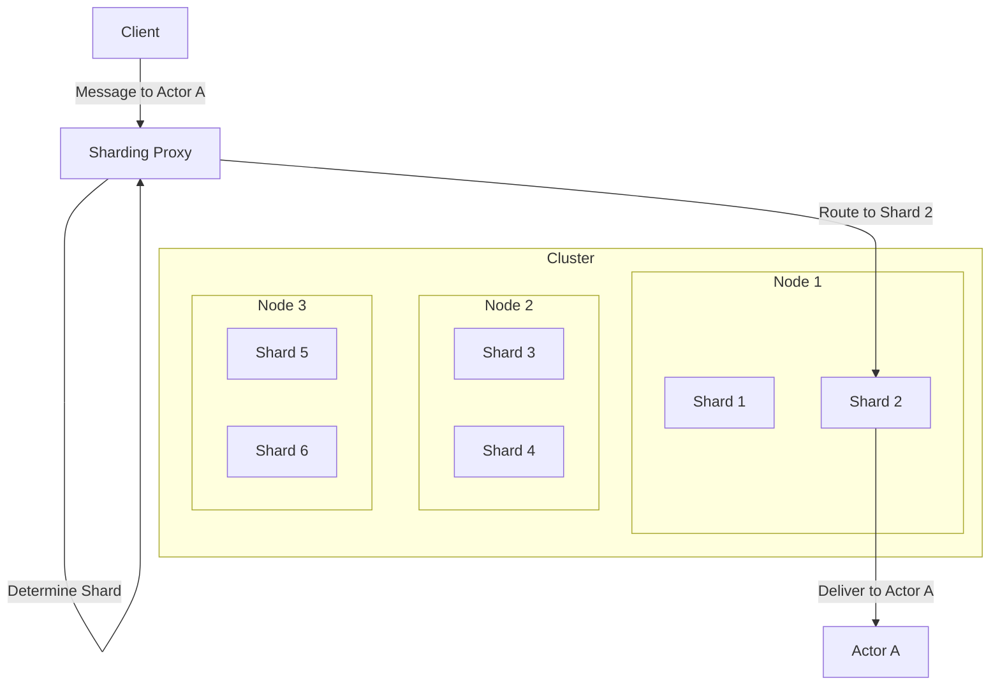

### Location Transparency

Enhance location transparency to allow actors to communicate seamlessly across nodes:

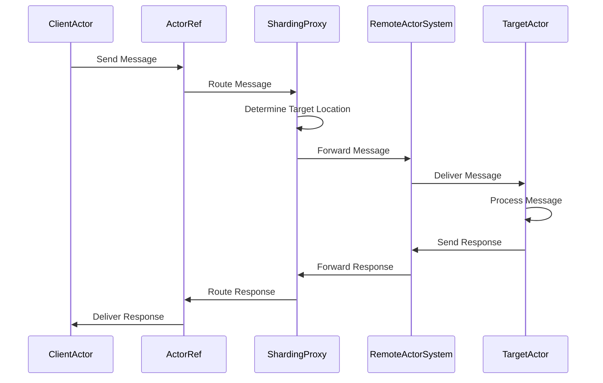

## Actor Supervision and Fault Tolerance

### Enhanced Supervision Strategies

Implement more sophisticated supervision strategies:

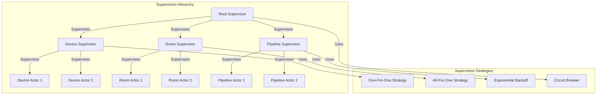

### Circuit Breaking

Implement circuit breaking to prevent cascading failures:

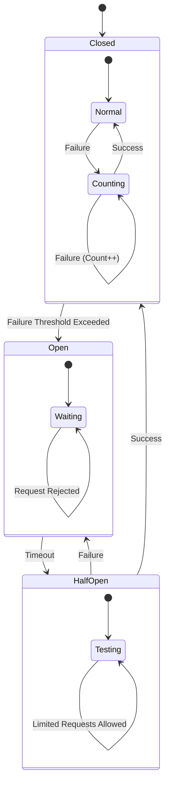

## Performance Optimization

### Actor Pooling

Implement actor pooling for stateless actors to improve performance:

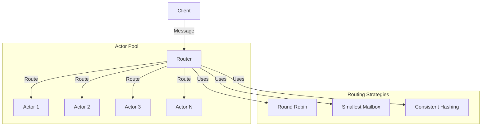

### Message Batching

Implement message batching to reduce overhead:

```mermaid
sequenceDiagram
    participant Client
    participant BatchingProxy
    participant Actor
    
    Client->>BatchingProxy: Message 1
    BatchingProxy->>BatchingProxy: Add to Batch
    Client->>BatchingProxy: Message 2
    BatchingProxy->>BatchingProxy: Add to Batch
    Client->>BatchingProxy: Message 3
    BatchingProxy->>BatchingProxy: Add to Batch
    
    Note over BatchingProxy: Batch Size Threshold or Timeout
    
    BatchingProxy->>Actor: Batch of Messages
    Actor->>Actor: Process Batch
    Actor-->>BatchingProxy: Batch Result
    BatchingProxy-->>Client: Result 1
    BatchingProxy-->>Client: Result 2
    BatchingProxy-->>Client: Result 3
```

## Edge Computing Integration

### Edge Actor System

Implement an edge actor system for low-latency processing:

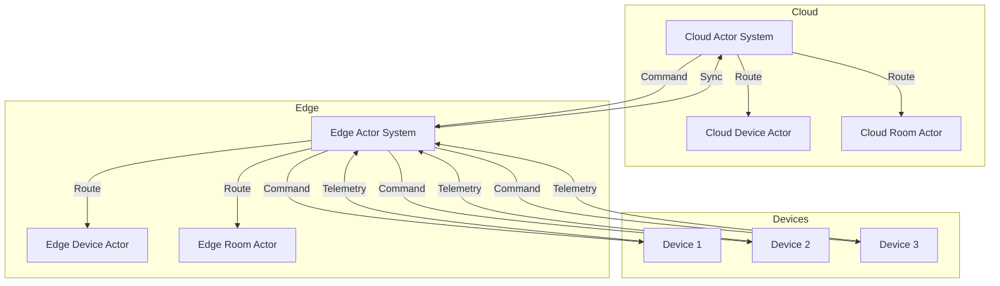

### Edge-Cloud Synchronization

Implement efficient edge-cloud synchronization:

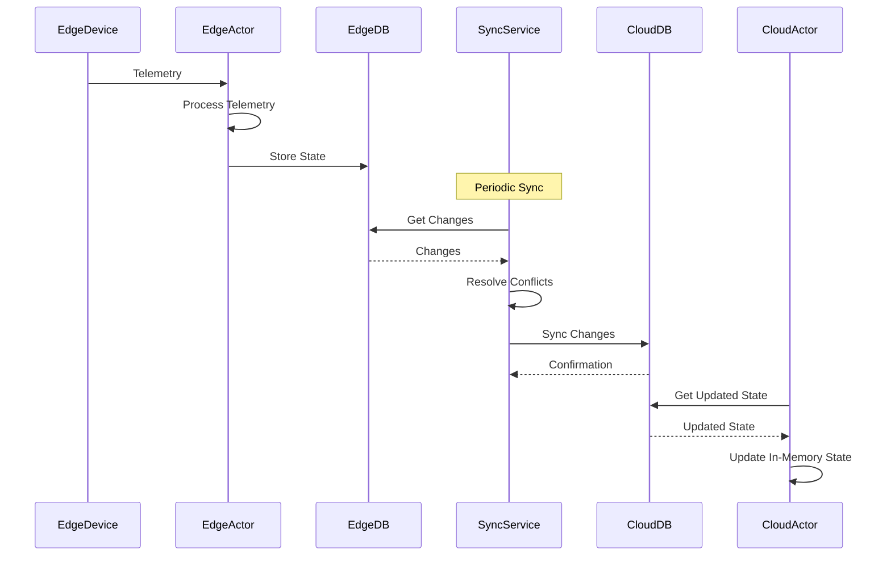

## Machine Learning Integration

### Anomaly Detection

Integrate machine learning for anomaly detection:

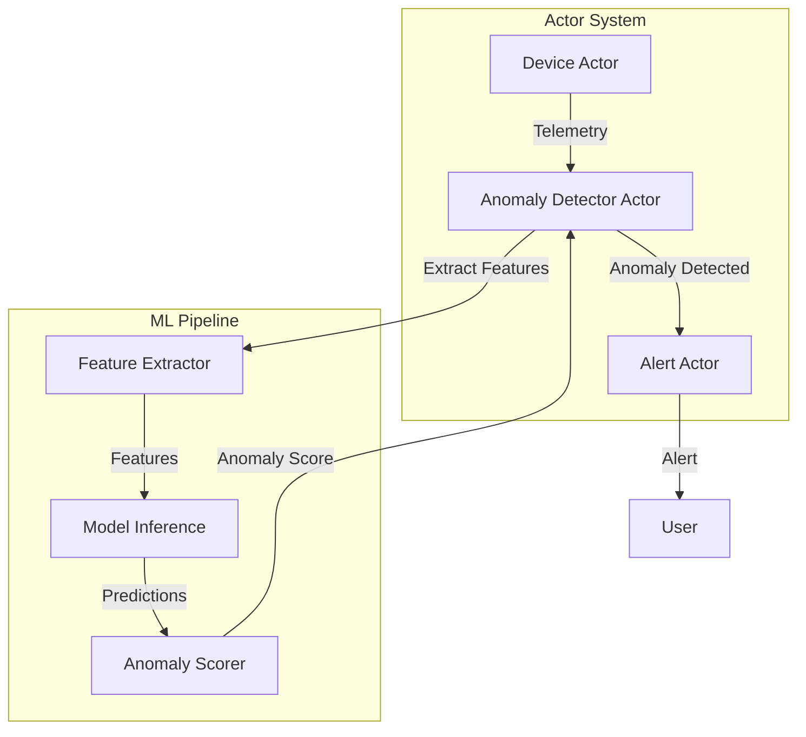

### Predictive Maintenance

Implement predictive maintenance using machine learning:

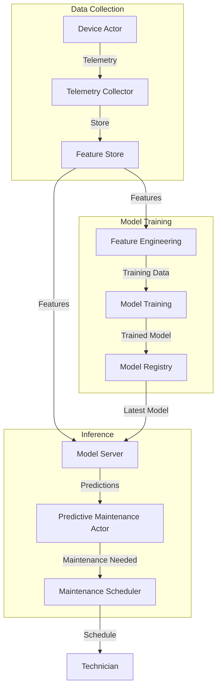

## Security Enhancements

### Zero Trust Architecture

Implement a zero trust architecture for enhanced security:

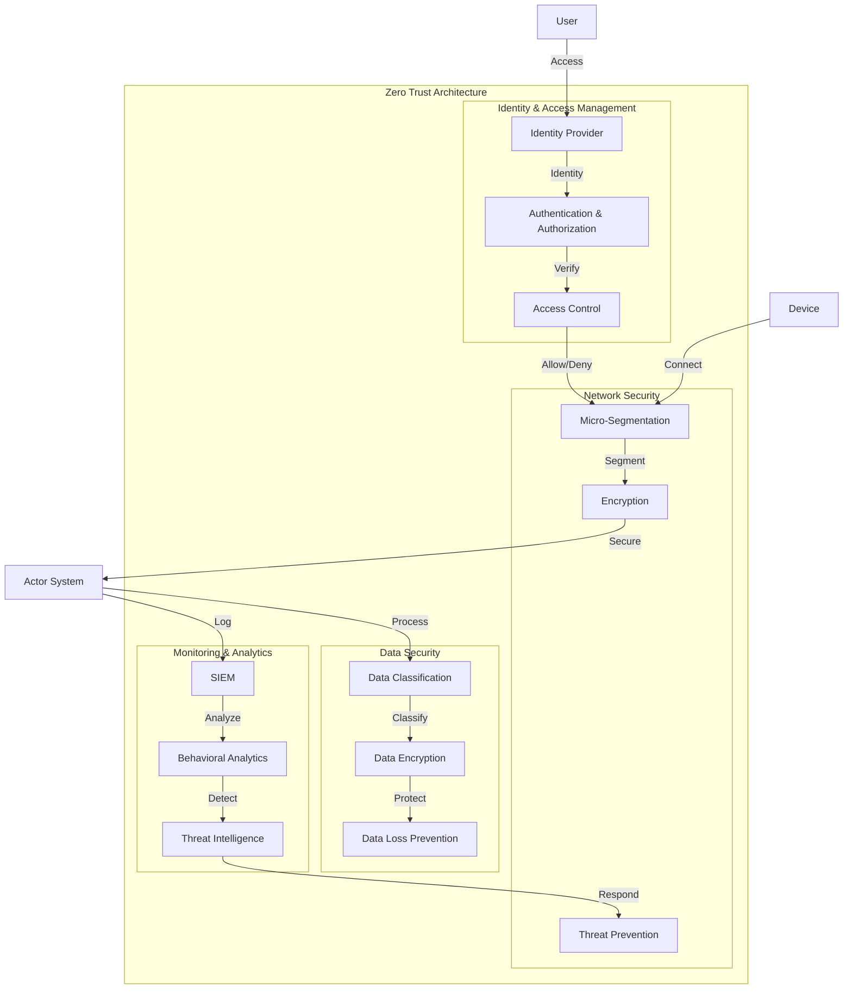

### Secure Actor Communication

Enhance secure actor communication:

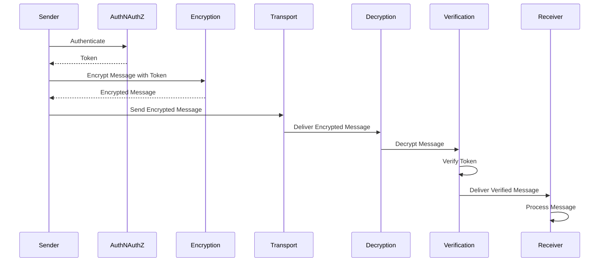

## User Experience Improvements

### Real-Time Visualization

Implement real-time visualization of the IoT system:

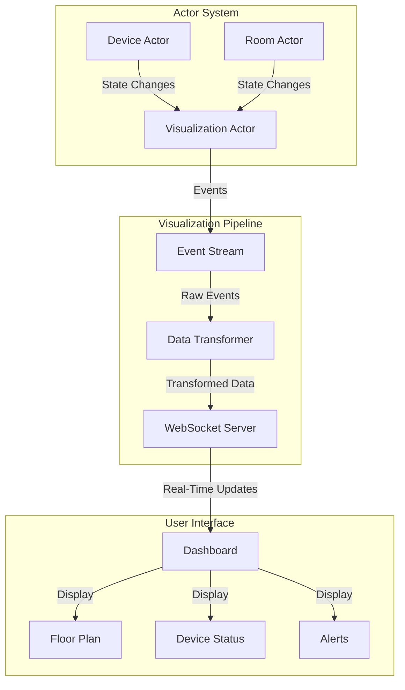

### Voice and Natural Language Control

Implement voice and natural language control for the IoT system:

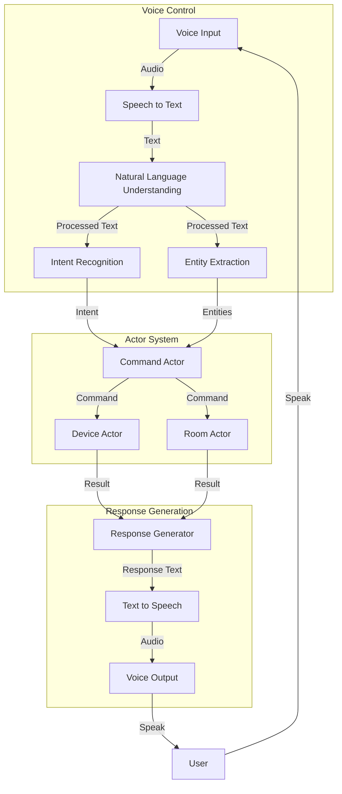

## Integration with Emerging Technologies

### Digital Twins

Enhance digital twin capabilities:

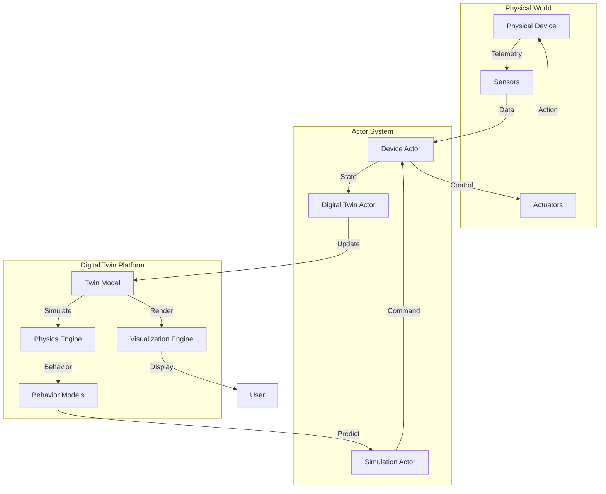

### Blockchain Integration

Integrate blockchain for secure and transparent IoT data:

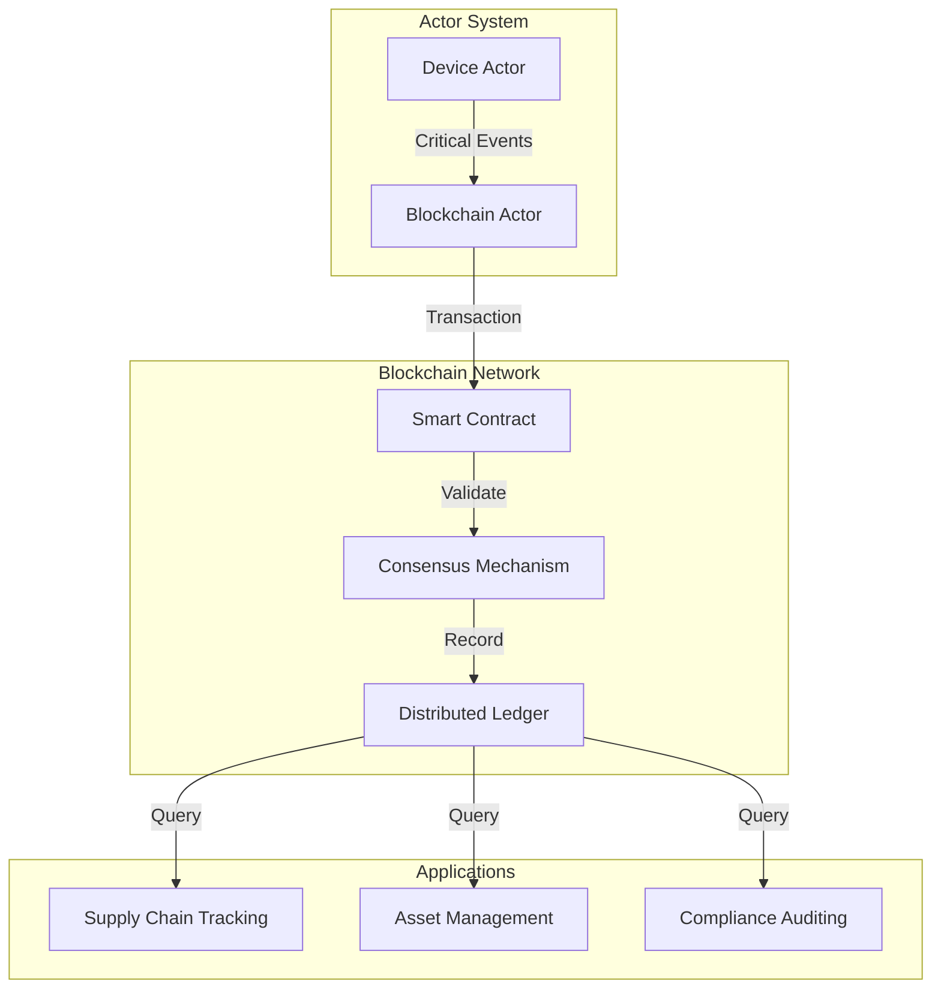

## Conclusion

The actor-based IoT system has a rich roadmap of future enhancements that will improve its functionality, performance, scalability, and reliability. By implementing these enhancements, the system will continue to evolve to meet the changing needs of IoT applications and leverage emerging technologies.
