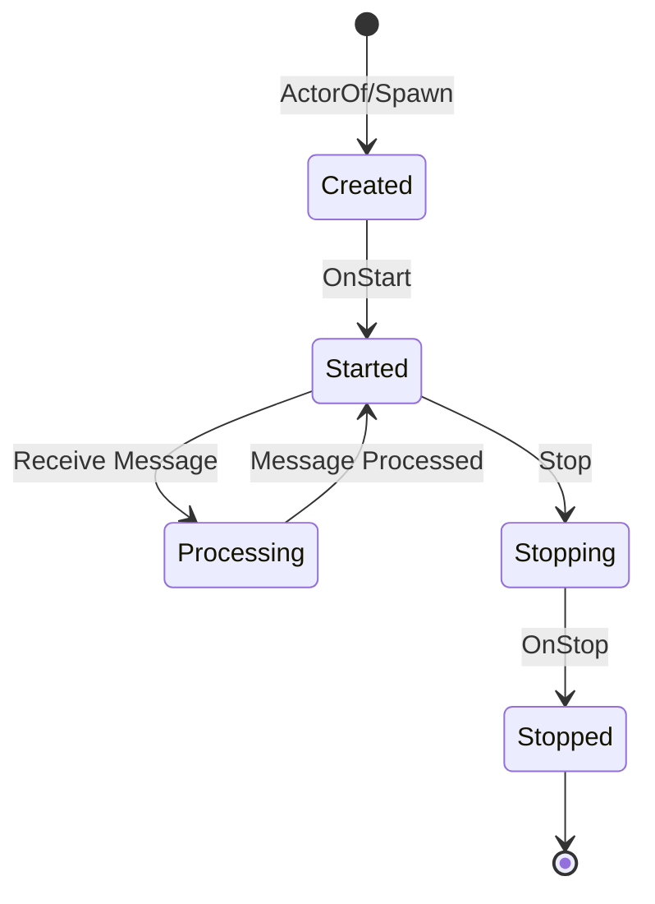
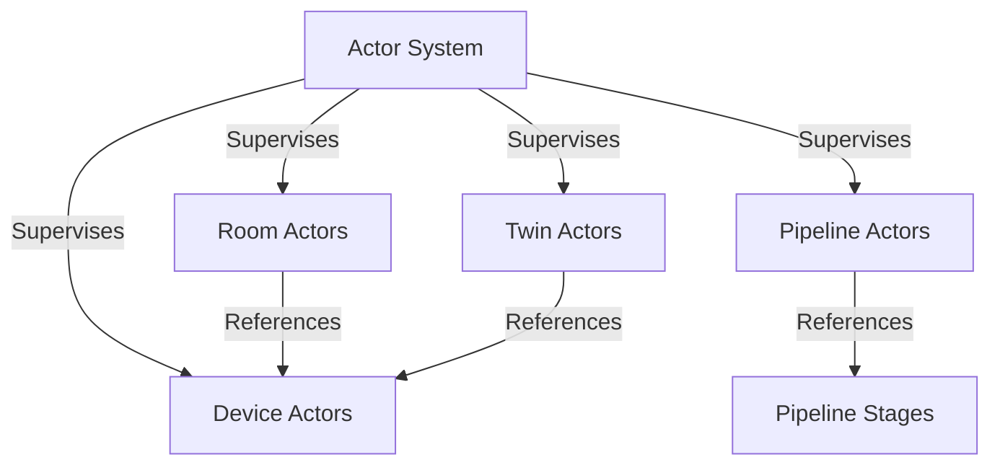

# 5. Actor Lifecycle

## Overview

This section describes the lifecycle of actors in the system, including their creation, initialization, message processing, and termination. Understanding the actor lifecycle is crucial for properly managing resources and ensuring correct behavior.

## Actor Lifecycle State Diagram



## Lifecycle Stages

### 1. Creation

Actors are created using the `ActorSystem.SpawnXXX()` methods, which create a new actor instance and return a PID (Process ID) that can be used to send messages to the actor. The creation process involves:

1. Creating a new instance of the actor struct
2. Assigning a unique ID to the actor
3. Creating a mailbox for the actor to receive messages
4. Registering the actor with the actor system

Example:
```go
// Create a new device actor
pid, err := actorSystem.SpawnDevice(deviceID)
```

### 2. Initialization

After creation, actors are initialized through the `Started` message, which is automatically sent to the actor by the actor system. The actor's `Receive` method handles this message and performs initialization tasks, such as:

1. Setting up initial state
2. Establishing connections to external systems
3. Starting background tasks
4. Logging the actor's startup

Example:
```go
func (a *DeviceActor) handleStarted(ctx actor.Context) {
    a.logger.Info("Device actor started")

    // Initialize state if not already initialized
    if a.state == nil {
        a.state = &device.Device{
            ID:        a.deviceID,
            Status:    device.StatusOffline,
            CreatedAt: time.Now(),
            UpdatedAt: time.Now(),
            Metadata:  make(map[string]string),
        }
    }
}
```

### 3. Message Processing

Once initialized, actors process messages sent to them through their `Receive` method. The message processing cycle involves:

1. Receiving a message from the mailbox
2. Determining the message type
3. Handling the message based on its type
4. Updating state if necessary
5. Sending responses or forwarding messages to other actors

Example:
```go
func (a *DeviceActor) Receive(ctx actor.Context) {
    switch msg := ctx.Message().(type) {
    case *actor.Started:
        a.handleStarted(ctx)
    case *actor.Stopped:
        a.handleStopped(ctx)
    case *message.Message:
        a.handleMessage(ctx, msg)
    case *UpdateStateCommand:
        a.handleUpdateState(ctx, msg)
    case *GetStateQuery:
        a.handleGetState(ctx, msg)
    default:
        a.logger.Warn("Received unknown message", "type", fmt.Sprintf("%T", msg))
    }
}
```

### 4. Termination

Actors are terminated through the `Stop` method, which sends a `Stopped` message to the actor. The actor's `Receive` method handles this message and performs cleanup tasks, such as:

1. Releasing resources
2. Closing connections
3. Stopping background tasks
4. Logging the actor's shutdown

Example:
```go
func (a *DeviceActor) handleStopped(ctx actor.Context) {
    a.logger.Info("Device actor stopped")
    // Perform cleanup tasks
}
```

## Actor Supervision

Actors can be supervised by other actors or by the actor system itself. Supervision provides a mechanism for handling failures and ensuring system resilience. When an actor fails (e.g., panics during message processing), its supervisor can take one of the following actions:

1. **Restart**: Stop the actor and create a new instance with the same ID
2. **Stop**: Terminate the actor permanently
3. **Escalate**: Pass the failure to the supervisor's supervisor
4. **Resume**: Ignore the failure and continue processing messages

The supervision strategy determines how failures are handled based on the type of failure and the actor's role in the system.

## Actor Hierarchy

Actors in the system form a hierarchy, with parent actors supervising child actors. The hierarchy is established through the actor creation process, where the creator of an actor becomes its parent.



In this hierarchy:
- The actor system is the root supervisor for all top-level actors
- Room actors reference device actors but do not supervise them
- Twin actors reference device actors but do not supervise them
- Pipeline actors reference pipeline stage actors but do not supervise them

## Actor Lifecycle Management

The actor service provides methods for managing the lifecycle of actors, including:

1. **Starting Actors**: Creating and initializing actors
2. **Stopping Actors**: Terminating actors and releasing resources
3. **Restarting Actors**: Stopping and starting actors to recover from failures
4. **Monitoring Actors**: Tracking the state and health of actors

Example:
```go
// Start a device actor
err := actorService.StartDeviceActor(ctx, deviceID)

// Stop a device actor
err := actorService.StopDeviceActor(ctx, deviceID)

// Restart a device actor (stop and start)
err := actorService.StopDeviceActor(ctx, deviceID)
if err == nil {
    err = actorService.StartDeviceActor(ctx, deviceID)
}
```

## Actor Persistence

Actors can persist their state to survive system restarts or failures. The persistence mechanism involves:

1. **Snapshots**: Periodically saving the actor's state to storage
2. **Event Sourcing**: Recording all state-changing events and replaying them to reconstruct state
3. **Recovery**: Restoring the actor's state from snapshots and events during initialization

While the current implementation does not include persistence, it can be added by implementing the appropriate interfaces and modifying the actor's initialization and message handling logic.

## Best Practices for Actor Lifecycle Management

1. **Proper Initialization**: Ensure actors are properly initialized during the `Started` phase
2. **Resource Cleanup**: Release all resources during the `Stopped` phase
3. **Idempotent Operations**: Design message handlers to be idempotent to handle message retries
4. **Graceful Shutdown**: Implement graceful shutdown procedures to avoid data loss
5. **Supervision Strategies**: Choose appropriate supervision strategies based on the actor's role and failure modes
6. **Monitoring**: Monitor actor lifecycle events to detect and diagnose issues
7. **Testing**: Test actor lifecycle events to ensure proper behavior during initialization, message processing, and termination
