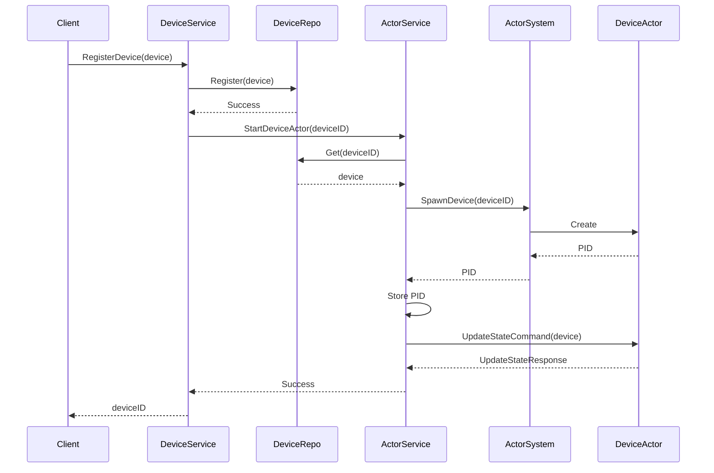
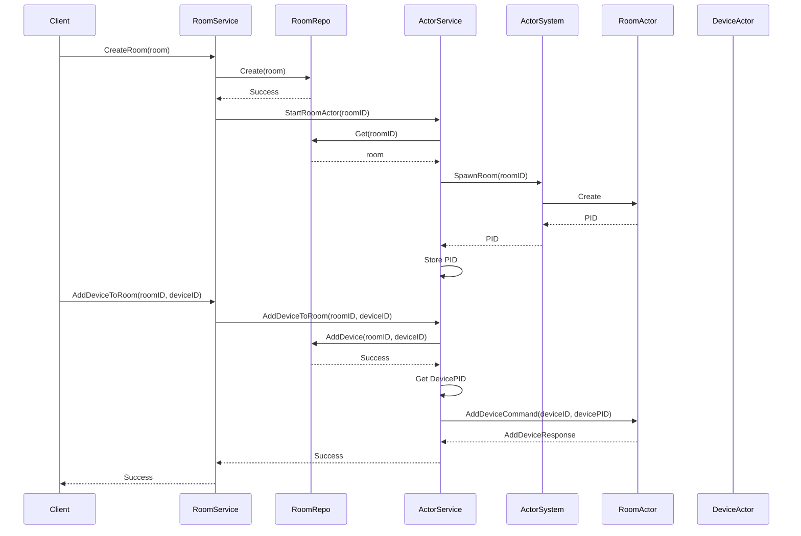
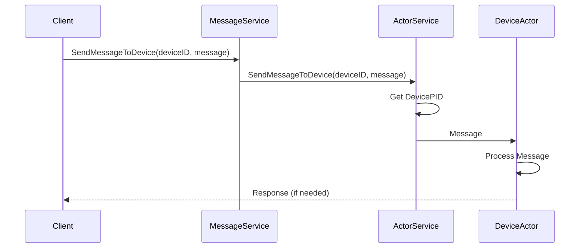
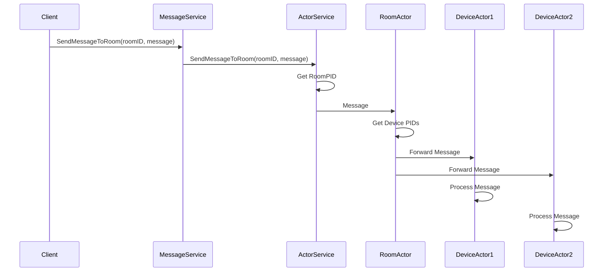
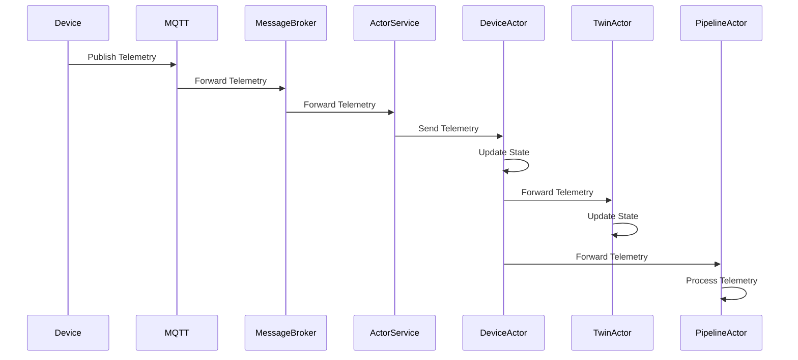
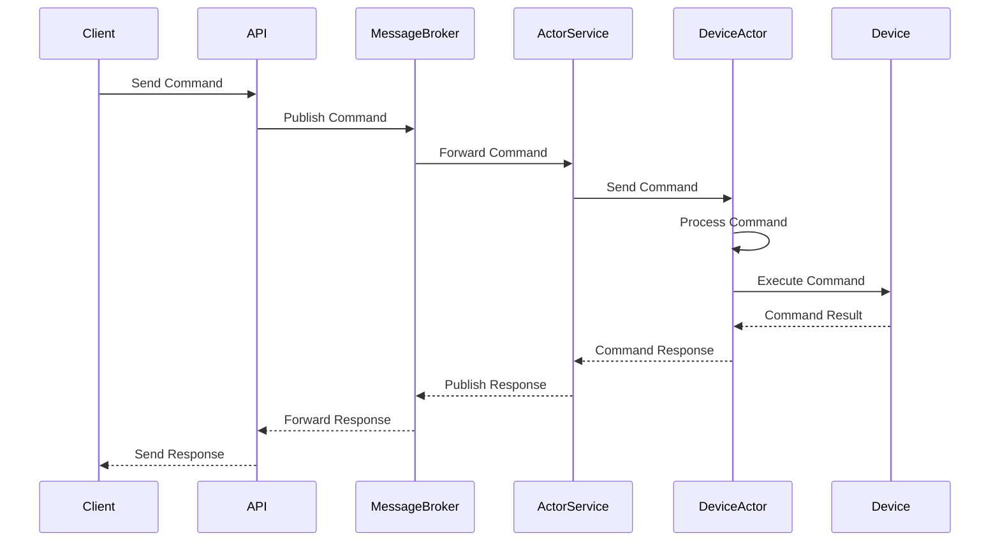
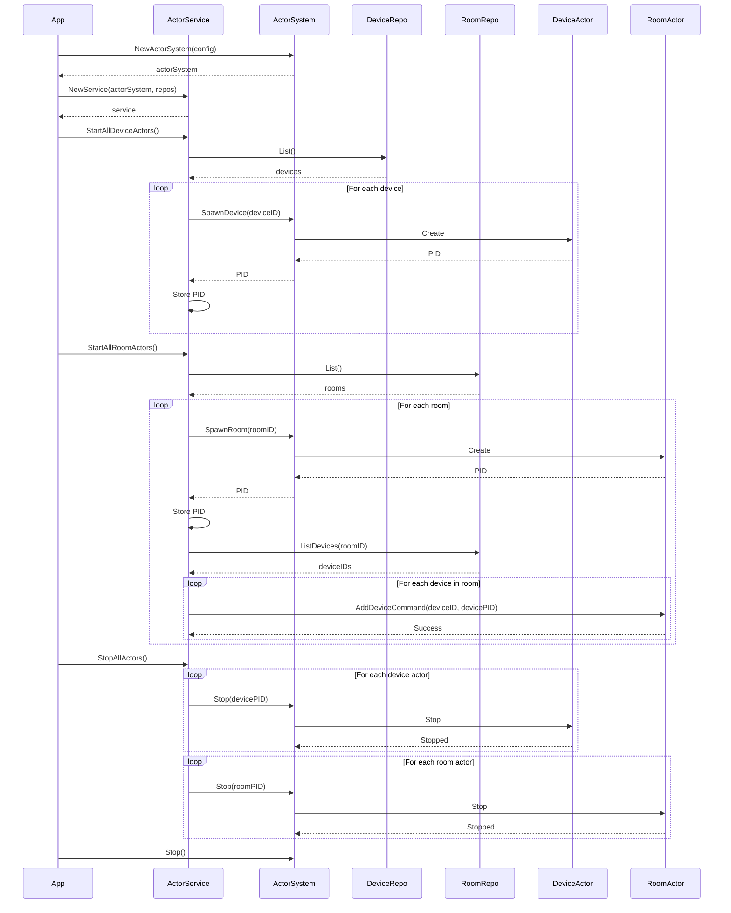

# 4. Message Flow Diagrams

## Overview

This section illustrates the key message flows in the actor-based IoT system. These diagrams show how different components interact through message passing to accomplish various tasks.

## Device Registration and Actor Creation

This diagram shows the process of registering a new device and creating a corresponding device actor.

### Process Description:

1. The client sends a request to register a new device to the DeviceService.
2. The DeviceService registers the device in the DeviceRepo.
3. The DeviceService requests the ActorService to start a device actor for the new device.
4. The ActorService retrieves the device details from the DeviceRepo.
5. The ActorService requests the ActorSystem to spawn a new device actor.
6. The ActorSystem creates a new DeviceActor and returns its PID (Process ID).
7. The ActorService stores the PID for future reference.
8. The ActorService sends an UpdateStateCommand to the DeviceActor to initialize its state.
9. The DeviceActor updates its state and responds with success.
10. The ActorService reports success to the DeviceService, which in turn responds to the client.

## Room Creation and Device Addition

This diagram shows the process of creating a new room and adding a device to it.

### Process Description:

1. The client sends a request to create a new room to the RoomService.
2. The RoomService creates the room in the RoomRepo.
3. The RoomService requests the ActorService to start a room actor for the new room.
4. The ActorService retrieves the room details from the RoomRepo.
5. The ActorService requests the ActorSystem to spawn a new room actor.
6. The ActorSystem creates a new RoomActor and returns its PID.
7. The ActorService stores the PID for future reference.
8. The client sends a request to add a device to the room.
9. The RoomService forwards the request to the ActorService.
10. The ActorService adds the device to the room in the RoomRepo.
11. The ActorService retrieves the device actor's PID.
12. The ActorService sends an AddDeviceCommand to the RoomActor.
13. The RoomActor adds the device and responds with success.
14. The ActorService reports success to the RoomService, which in turn responds to the client.

## Message Sending to Device

This diagram shows the process of sending a message to a device.

### Process Description:

1. The client sends a message to a device through the MessageService.
2. The MessageService forwards the message to the ActorService.
3. The ActorService retrieves the device actor's PID.
4. The ActorService sends the message to the DeviceActor.
5. The DeviceActor processes the message.
6. If a response is needed, the DeviceActor sends it back to the client.

## Message Broadcasting to Room

This diagram shows the process of broadcasting a message to all devices in a room.

### Process Description:

1. The client sends a message to a room through the MessageService.
2. The MessageService forwards the message to the ActorService.
3. The ActorService retrieves the room actor's PID.
4. The ActorService sends the message to the RoomActor.
5. The RoomActor retrieves the PIDs of all device actors in the room.
6. The RoomActor forwards the message to each device actor.
7. Each device actor processes the message.

## Telemetry Processing Flow

This diagram shows the process of processing telemetry data from a device.

### Process Description:

1. The physical device publishes telemetry data to the MQTT broker.
2. The MQTT broker forwards the telemetry data to the message broker.
3. The message broker forwards the telemetry data to the ActorService.
4. The ActorService sends the telemetry data to the appropriate DeviceActor.
5. The DeviceActor updates its state based on the telemetry data.
6. The DeviceActor forwards the telemetry data to the corresponding TwinActor.
7. The TwinActor updates its state based on the telemetry data.
8. The DeviceActor forwards the telemetry data to the PipelineActor for processing.
9. The PipelineActor processes the telemetry data through its stages.

## Command Execution Flow

This diagram shows the process of executing a command on a device.

### Process Description:

1. The client sends a command to the API.
2. The API publishes the command to the message broker.
3. The message broker forwards the command to the ActorService.
4. The ActorService sends the command to the appropriate DeviceActor.
5. The DeviceActor processes the command.
6. The DeviceActor executes the command on the physical device.
7. The physical device returns the command result to the DeviceActor.
8. The DeviceActor sends the command response to the ActorService.
9. The ActorService publishes the response to the message broker.
10. The message broker forwards the response to the API.
11. The API sends the response to the client.

## Actor System Startup and Shutdown

This diagram shows the process of starting up and shutting down the actor system.

### Process Description:

1. The application creates a new actor system.
2. The application creates a new actor service with the actor system and repositories.
3. The application requests the actor service to start all device actors.
4. The actor service retrieves all devices from the device repository.
5. For each device, the actor service spawns a device actor and stores its PID.
6. The application requests the actor service to start all room actors.
7. The actor service retrieves all rooms from the room repository.
8. For each room, the actor service spawns a room actor and stores its PID.
9. For each room, the actor service retrieves the devices in the room and adds them to the room actor.
10. When shutting down, the application requests the actor service to stop all actors.
11. The actor service stops all device actors and room actors.
12. The application stops the actor system.
