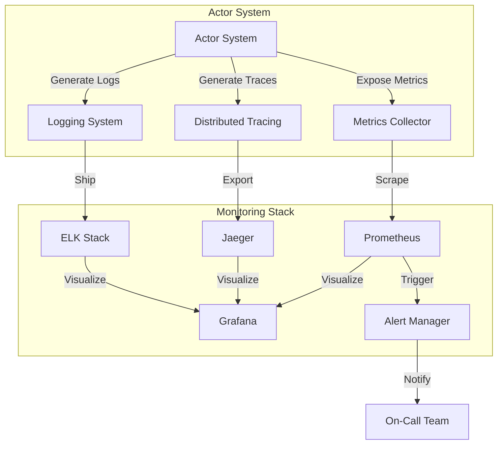
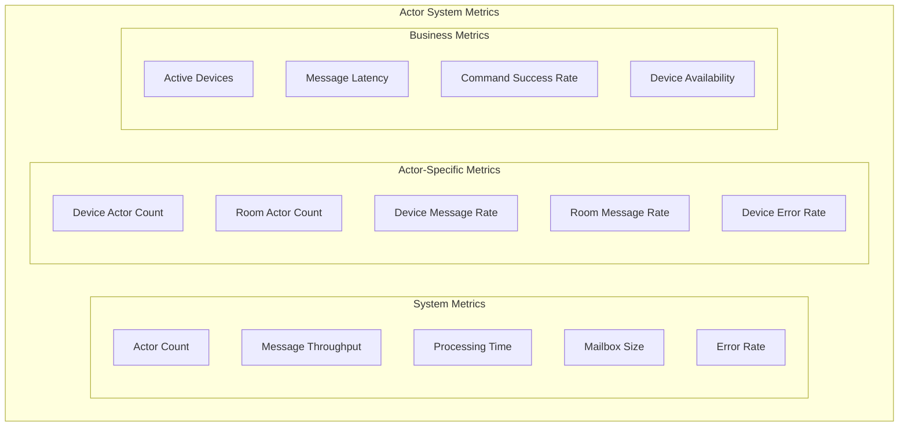

# 13. Monitoring and Observability

## Overview

This section describes the monitoring and observability strategy for the actor-based IoT system. Effective monitoring and observability are essential for understanding the system's behavior, detecting issues, and ensuring optimal performance.

## Monitoring Architecture

The following diagram illustrates the monitoring architecture for the system:



## Metrics Collection

The system collects various metrics to monitor its health, performance, and behavior.

### Actor System Metrics



### Key Metrics

The following key metrics are collected:

1. **Actor Count**: Number of actors by type and total.
2. **Message Throughput**: Number of messages processed per second, by type and actor.
3. **Processing Time**: Time taken to process messages, by type and actor.
4. **Mailbox Size**: Size of actor mailboxes, indicating potential bottlenecks.
5. **Error Rate**: Number of errors encountered during message processing.
6. **Memory Usage**: Memory used by the actor system and individual actors.
7. **CPU Usage**: CPU used by the actor system and individual actors.
8. **Garbage Collection**: Frequency and duration of garbage collection pauses.
9. **Network I/O**: Network traffic between components.
10. **Disk I/O**: Disk operations for persistence.

### Metrics Implementation

Metrics are implemented using Prometheus client libraries and exposed through HTTP endpoints. The following example shows how to instrument the actor system with metrics:

```go
// Create Prometheus metrics
var (
    actorCount = prometheus.NewGaugeVec(
        prometheus.GaugeOpts{
            Name: "actor_count",
            Help: "Number of actors by type",
        },
        []string{"actor_type"},
    )
    
    messageProcessed = prometheus.NewCounterVec(
        prometheus.CounterOpts{
            Name: "message_processed_total",
            Help: "Number of messages processed by type",
        },
        []string{"actor_type", "message_type"},
    )
    
    messageProcessingTime = prometheus.NewHistogramVec(
        prometheus.HistogramOpts{
            Name:    "message_processing_time_seconds",
            Help:    "Time taken to process messages",
            Buckets: prometheus.ExponentialBuckets(0.001, 2, 10),
        },
        []string{"actor_type", "message_type"},
    )
    
    mailboxSize = prometheus.NewGaugeVec(
        prometheus.GaugeOpts{
            Name: "mailbox_size",
            Help: "Size of actor mailboxes",
        },
        []string{"actor_id", "actor_type"},
    )
    
    errorCount = prometheus.NewCounterVec(
        prometheus.CounterOpts{
            Name: "error_total",
            Help: "Number of errors encountered",
        },
        []string{"actor_type", "error_type"},
    )
)

// Register metrics with Prometheus
func init() {
    prometheus.MustRegister(actorCount)
    prometheus.MustRegister(messageProcessed)
    prometheus.MustRegister(messageProcessingTime)
    prometheus.MustRegister(mailboxSize)
    prometheus.MustRegister(errorCount)
}

// Instrument actor system with metrics middleware
func instrumentActorSystem(actorSystem *actor.ActorSystem) {
    actorSystem.Use(func(next actor.ReceiverFunc) actor.ReceiverFunc {
        return func(ctx actor.Context) {
            // Update actor count
            actorType := getActorType(ctx.Self())
            actorCount.WithLabelValues(actorType).Inc()
            
            // Record message processing
            messageType := getMessageType(ctx.Message())
            messageProcessed.WithLabelValues(actorType, messageType).Inc()
            
            // Measure processing time
            start := time.Now()
            next(ctx)
            duration := time.Since(start).Seconds()
            messageProcessingTime.WithLabelValues(actorType, messageType).Observe(duration)
            
            // Update mailbox size
            mailboxSize.WithLabelValues(ctx.Self().ID, actorType).Set(float64(getMailboxSize(ctx)))
            
            // Record errors
            if err := getError(ctx); err != nil {
                errorType := getErrorType(err)
                errorCount.WithLabelValues(actorType, errorType).Inc()
            }
        }
    })
}

// Expose metrics endpoint
func exposeMetricsEndpoint() {
    http.Handle("/metrics", promhttp.Handler())
    go http.ListenAndServe(":8080", nil)
}
```

## Distributed Tracing

Distributed tracing is used to track the flow of requests through the system, helping to identify performance bottlenecks and troubleshoot issues.

### Trace Context Propagation

Trace context is propagated through the system using message metadata. The following example shows how to implement trace context propagation:

```go
// Add tracing middleware to actor system
func addTracingMiddleware(actorSystem *actor.ActorSystem) {
    actorSystem.Use(func(next actor.ReceiverFunc) actor.ReceiverFunc {
        return func(ctx actor.Context) {
            // Extract trace context from message
            var spanContext opentracing.SpanContext
            if msg, ok := ctx.Message().(*message.Message); ok {
                if traceID, ok := msg.Metadata["trace_id"]; ok {
                    spanContext = extractSpanContext(traceID)
                }
            }
            
            // Create span
            var span opentracing.Span
            if spanContext != nil {
                span = opentracing.StartSpan(
                    fmt.Sprintf("%s.Receive", getActorType(ctx.Self())),
                    opentracing.ChildOf(spanContext),
                )
            } else {
                span = opentracing.StartSpan(
                    fmt.Sprintf("%s.Receive", getActorType(ctx.Self())),
                )
            }
            defer span.Finish()
            
            // Add span context to actor context
            actorCtx := &tracingContext{
                Context: ctx,
                span:    span,
            }
            
            // Process message
            next(actorCtx)
        }
    })
}

// Tracing context wrapper
type tracingContext struct {
    actor.Context
    span opentracing.Span
}

// Propagate trace context when sending messages
func (ctx *tracingContext) Send(target *actor.PID, message interface{}) {
    // Add trace context to message
    if msg, ok := message.(*message.Message); ok {
        if msg.Metadata == nil {
            msg.Metadata = make(map[string]string)
        }
        injectSpanContext(ctx.span.Context(), msg.Metadata)
    }
    
    // Send message
    ctx.Context.Send(target, message)
}
```

### Trace Visualization

Traces are visualized using Jaeger, allowing developers to see the flow of requests through the system and identify performance bottlenecks.

## Logging

Logging is used to record events and errors in the system, providing valuable information for debugging and troubleshooting.

### Log Levels

The system uses the following log levels:

1. **Debug**: Detailed information for debugging.
2. **Info**: General information about system operation.
3. **Warn**: Potential issues that don't affect normal operation.
4. **Error**: Errors that affect normal operation but don't require immediate attention.
5. **Fatal**: Critical errors that require immediate attention and may cause the system to shut down.

### Structured Logging

The system uses structured logging to make logs more searchable and analyzable. The following example shows how to implement structured logging:

```go
// Create structured logger
logger := logger.NewZapLogger("debug")

// Log with structured fields
logger.Info("Device actor started",
    "actor_id", actorID,
    "device_id", deviceID,
    "device_type", deviceType,
)

// Log error with context
logger.Error("Failed to process message",
    "actor_id", actorID,
    "message_id", messageID,
    "message_type", messageType,
    "error", err,
)
```

### Log Correlation

Logs are correlated with traces using trace IDs, allowing developers to see the logs associated with a particular trace.

```go
// Add trace ID to log context
func (ctx *tracingContext) Logger() logger.Logger {
    traceID := getTraceID(ctx.span.Context())
    return ctx.Context.Logger().With("trace_id", traceID)
}
```

## Alerting

Alerts are triggered when certain conditions are met, such as high error rates or resource utilization. The following example shows how to configure alerts:

```yaml
# Prometheus Alert Rules
groups:
- name: actor_system
  rules:
  - alert: HighErrorRate
    expr: sum(rate(error_total[5m])) by (actor_type) > 0.01
    for: 5m
    labels:
      severity: warning
    annotations:
      summary: "High error rate for {{ $labels.actor_type }} actors"
      description: "Error rate for {{ $labels.actor_type }} actors is {{ $value }} errors per second for the last 5 minutes"
      
  - alert: MailboxBacklog
    expr: max(mailbox_size) by (actor_id, actor_type) > 1000
    for: 5m
    labels:
      severity: warning
    annotations:
      summary: "Mailbox backlog for {{ $labels.actor_type }} actor {{ $labels.actor_id }}"
      description: "Mailbox size for {{ $labels.actor_type }} actor {{ $labels.actor_id }} is {{ $value }} messages for the last 5 minutes"
      
  - alert: HighMessageLatency
    expr: histogram_quantile(0.95, sum(rate(message_processing_time_seconds_bucket[5m])) by (actor_type, message_type, le)) > 0.1
    for: 5m
    labels:
      severity: warning
    annotations:
      summary: "High message latency for {{ $labels.actor_type }} actors processing {{ $labels.message_type }} messages"
      description: "95th percentile latency for {{ $labels.actor_type }} actors processing {{ $labels.message_type }} messages is {{ $value }} seconds for the last 5 minutes"
```

## Dashboards

Dashboards provide a visual representation of the system's health, performance, and behavior. The following example shows a Grafana dashboard for the actor system:

```json
{
  "dashboard": {
    "title": "Actor System Dashboard",
    "panels": [
      {
        "title": "Actor Count",
        "type": "graph",
        "targets": [
          {
            "expr": "sum(actor_count) by (actor_type)",
            "legendFormat": "{{ actor_type }}"
          }
        ]
      },
      {
        "title": "Message Throughput",
        "type": "graph",
        "targets": [
          {
            "expr": "sum(rate(message_processed_total[1m])) by (actor_type, message_type)",
            "legendFormat": "{{ actor_type }} - {{ message_type }}"
          }
        ]
      },
      {
        "title": "Message Processing Time (95th Percentile)",
        "type": "graph",
        "targets": [
          {
            "expr": "histogram_quantile(0.95, sum(rate(message_processing_time_seconds_bucket[1m])) by (actor_type, message_type, le))",
            "legendFormat": "{{ actor_type }} - {{ message_type }}"
          }
        ]
      },
      {
        "title": "Mailbox Size",
        "type": "graph",
        "targets": [
          {
            "expr": "max(mailbox_size) by (actor_type)",
            "legendFormat": "{{ actor_type }}"
          }
        ]
      },
      {
        "title": "Error Rate",
        "type": "graph",
        "targets": [
          {
            "expr": "sum(rate(error_total[1m])) by (actor_type, error_type)",
            "legendFormat": "{{ actor_type }} - {{ error_type }}"
          }
        ]
      }
    ]
  }
}
```

## Health Checks

Health checks are used to verify that the system and its components are functioning correctly. The following example shows how to implement health checks:

```go
// Health check handler
func healthCheckHandler(w http.ResponseWriter, r *http.Request) {
    // Check actor system health
    actorSystemHealth := checkActorSystemHealth()
    
    // Check database health
    databaseHealth := checkDatabaseHealth()
    
    // Check message broker health
    messageBrokerHealth := checkMessageBrokerHealth()
    
    // Overall health
    overallHealth := actorSystemHealth && databaseHealth && messageBrokerHealth
    
    // Return health status
    if overallHealth {
        w.WriteHeader(http.StatusOK)
        w.Write([]byte("OK"))
    } else {
        w.WriteHeader(http.StatusServiceUnavailable)
        w.Write([]byte("Service Unavailable"))
    }
}

// Check actor system health
func checkActorSystemHealth() bool {
    // Check if actor system is running
    if !actorSystem.IsRunning() {
        return false
    }
    
    // Check if actor system is processing messages
    if getMessageProcessingRate() < 0.1 {
        return false
    }
    
    // Check if error rate is acceptable
    if getErrorRate() > 0.01 {
        return false
    }
    
    return true
}
```

## Anomaly Detection

Anomaly detection is used to identify unusual patterns in the system's behavior that might indicate issues. The following example shows how to implement anomaly detection:

```go
// Anomaly detection for message processing time
func detectAnomalies() {
    // Get historical data
    historicalData := getHistoricalMessageProcessingTime(24 * time.Hour)
    
    // Calculate mean and standard deviation
    mean, stdDev := calculateStats(historicalData)
    
    // Set threshold for anomaly detection
    threshold := mean + 3 * stdDev
    
    // Monitor current processing time
    go func() {
        for {
            // Get current processing time
            currentTime := getCurrentMessageProcessingTime()
            
            // Check if current time exceeds threshold
            if currentTime > threshold {
                // Log anomaly
                logger.Warn("Anomaly detected in message processing time",
                    "current_time", currentTime,
                    "threshold", threshold,
                    "mean", mean,
                    "std_dev", stdDev,
                )
                
                // Trigger alert
                triggerAnomaly("message_processing_time", currentTime, threshold)
            }
            
            // Wait before next check
            time.Sleep(1 * time.Minute)
        }
    }()
}
```

## Capacity Planning

Monitoring data is used for capacity planning, helping to predict future resource requirements based on historical trends. The following example shows how to implement capacity planning:

```go
// Capacity planning for actor system
func planCapacity() {
    // Get historical data
    historicalData := getHistoricalActorCount(30 * 24 * time.Hour)
    
    // Calculate growth rate
    growthRate := calculateGrowthRate(historicalData)
    
    // Predict future actor count
    futureActorCount := predictFutureActorCount(historicalData, growthRate, 30 * 24 * time.Hour)
    
    // Calculate resource requirements
    cpuRequirements := calculateCPURequirements(futureActorCount)
    memoryRequirements := calculateMemoryRequirements(futureActorCount)
    
    // Log capacity planning results
    logger.Info("Capacity planning results",
        "current_actor_count", getCurrentActorCount(),
        "predicted_actor_count", futureActorCount,
        "growth_rate", growthRate,
        "cpu_requirements", cpuRequirements,
        "memory_requirements", memoryRequirements,
    )
}
```

## Best Practices for Monitoring and Observability

The following best practices are followed for monitoring and observability:

1. **Instrument Everything**: Instrument all components with metrics, traces, and logs.
2. **Use Structured Logging**: Use structured logging to make logs more searchable and analyzable.
3. **Correlate Logs and Traces**: Correlate logs with traces using trace IDs.
4. **Monitor Key Metrics**: Monitor key metrics that indicate system health and performance.
5. **Set Appropriate Alerts**: Set alerts for conditions that require attention.
6. **Use Dashboards**: Create dashboards to visualize system health and performance.
7. **Implement Health Checks**: Implement health checks to verify system functionality.
8. **Detect Anomalies**: Implement anomaly detection to identify unusual patterns.
9. **Plan Capacity**: Use monitoring data for capacity planning.
10. **Review and Improve**: Regularly review monitoring and observability practices and improve them based on experience.

## Conclusion

Effective monitoring and observability are essential for understanding the behavior of the actor-based IoT system, detecting issues, and ensuring optimal performance. By implementing comprehensive metrics collection, distributed tracing, structured logging, alerting, and dashboards, the system can be effectively monitored and observed, leading to improved reliability, performance, and user experience.
