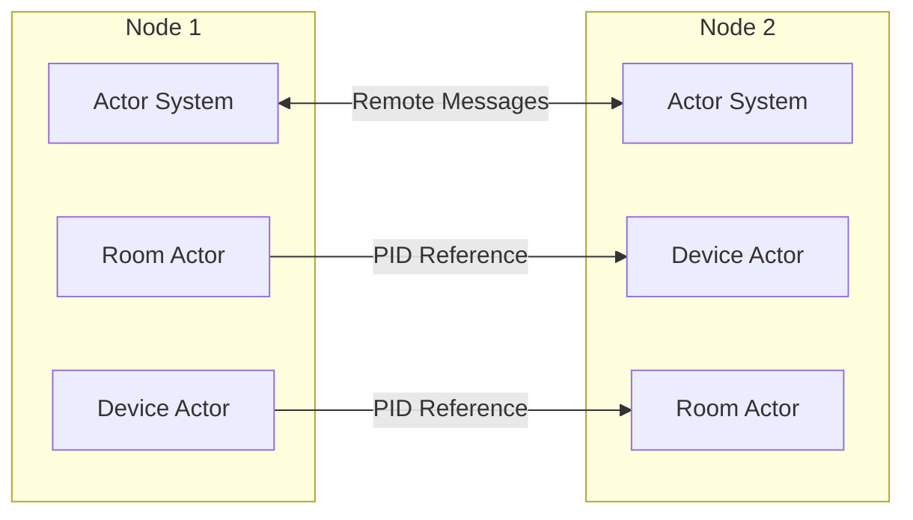
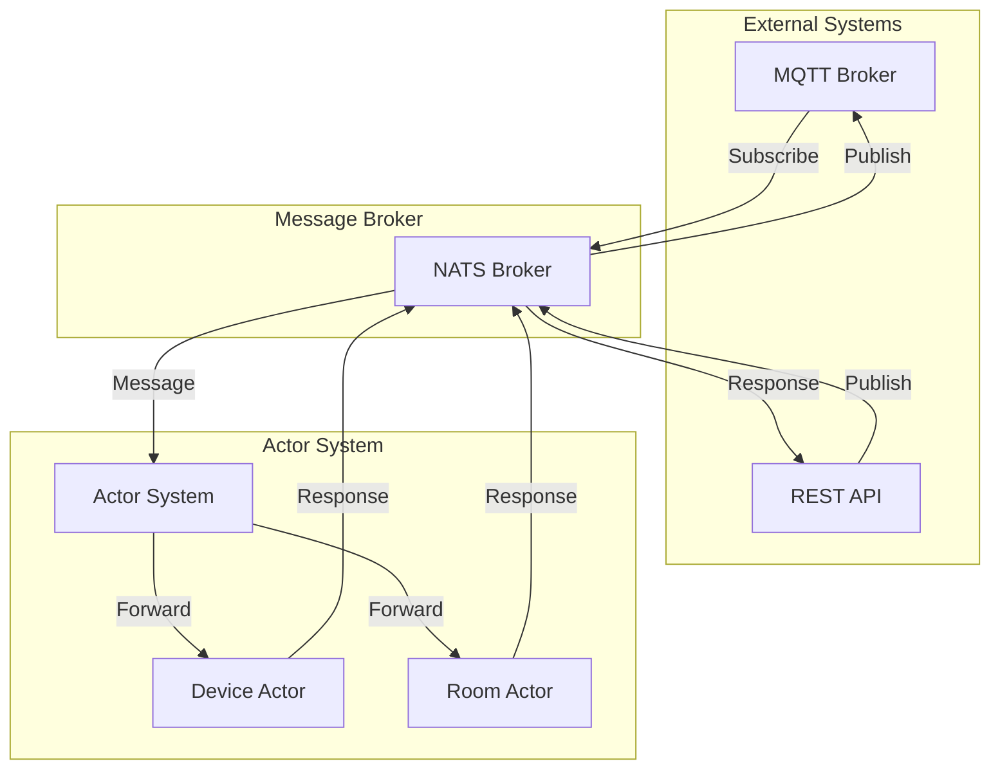

# 6. Network Communication

## Overview

This section describes how actors communicate across network boundaries in a distributed actor system. The `go-hollywood` package provides built-in support for remote actors, allowing the system to scale across multiple nodes.

## Remote Actor Communication



## Remote Actor System Configuration

To enable remote communication between actor systems, each node must be configured with a network address and port. The `Config` struct in the actor system provides fields for this configuration:

```go
type Config struct {
    Address     string
    Port        int
    ClusterName string
}
```

When creating a new actor system, this configuration is used to set up the remote communication engine:

```go
func NewActorSystem(config Config, log logger.Logger) *ActorSystem {
    // Create a new actor engine
    engine := actor.NewEngine()

    // Configure remote if address is provided
    if config.Address != "" {
        remoteConfig := remote.Config{
            DefaultSerializerID: 0, // Use the default serializer
        }

        // Create a new remote engine
        remote.NewEngine(engine, remote.NewNetworkTransport(fmt.Sprintf("%s:%d", config.Address, config.Port)), remoteConfig)
    }

    return &ActorSystem{
        engine: engine,
        config: config,
        logger: log.With("component", "actor_system"),
    }
}
```

## Message Serialization

When messages are sent between actors on different nodes, they must be serialized and deserialized. The `go-hollywood` package provides a default serializer that uses Protocol Buffers for efficient binary serialization.

For custom message types, you may need to implement custom serializers by implementing the `remote.Serializer` interface:

```go
type Serializer interface {
    ID() int32
    Serialize(v interface{}) ([]byte, error)
    Deserialize(bytes []byte, t reflect.Type) (interface{}, error)
}
```

## Actor References

Actors on different nodes can reference each other using PIDs (Process IDs). A PID contains the address of the node where the actor is located, allowing messages to be routed correctly across the network.

When a message is sent to a remote actor, the following steps occur:

1. The message is serialized using the configured serializer
2. The message is sent to the remote node using the network transport
3. The remote node receives the message and deserializes it
4. The message is delivered to the target actor's mailbox

## Message Broker Integration

In addition to direct actor-to-actor communication, the system integrates with message brokers like NATS to enable communication with external systems.



The message broker integration allows:

1. **External Communication**: Actors can communicate with external systems through the message broker
2. **Protocol Translation**: Messages can be translated between different protocols (e.g., MQTT, HTTP)
3. **Message Routing**: Messages can be routed to the appropriate actors based on topics or subjects
4. **Load Balancing**: Messages can be distributed across multiple instances of the same actor type

## Network Security

Securing network communication is essential for protecting the system from unauthorized access and ensuring data confidentiality and integrity. The following security measures should be implemented:

1. **TLS Encryption**: All network communication should be encrypted using TLS
2. **Authentication**: Nodes should authenticate each other using certificates or other credentials
3. **Authorization**: Access to actors and messages should be controlled based on roles and permissions
4. **Message Signing**: Messages should be signed to verify their authenticity
5. **Network Segmentation**: The actor system should be deployed in a segmented network to limit exposure

## Network Resilience

To ensure reliable communication in the face of network issues, the following resilience measures should be implemented:

1. **Retry Mechanisms**: Failed message deliveries should be retried with appropriate backoff strategies
2. **Circuit Breakers**: Repeated failures should trigger circuit breakers to prevent cascading failures
3. **Message Buffering**: Messages should be buffered when the target actor is temporarily unavailable
4. **Acknowledgments**: Critical messages should be acknowledged to confirm delivery
5. **Idempotent Operations**: Message handlers should be idempotent to handle message duplicates

## Network Monitoring

Monitoring network communication is essential for detecting and diagnosing issues. The following metrics should be collected:

1. **Message Throughput**: Number of messages sent and received per second
2. **Message Latency**: Time taken for messages to be delivered
3. **Error Rate**: Number of failed message deliveries
4. **Network Bandwidth**: Amount of network bandwidth used
5. **Connection Count**: Number of active connections between nodes

## Example: Remote Actor Communication

Here's an example of how to configure and use remote actor communication:

```go
// Node 1: Create actor system with remote configuration
config1 := actor.Config{
    Address:     "192.168.1.1",
    Port:        8000,
    ClusterName: "iot-cluster",
}
actorSystem1 := actor.NewActorSystem(config1, logger)

// Node 2: Create actor system with remote configuration
config2 := actor.Config{
    Address:     "192.168.1.2",
    Port:        8000,
    ClusterName: "iot-cluster",
}
actorSystem2 := actor.NewActorSystem(config2, logger)

// Node 1: Spawn a device actor
devicePID, _ := actorSystem1.SpawnDevice("device-1")

// Node 2: Create a remote PID for the device actor on Node 1
remoteDevicePID := actor.NewPID("192.168.1.1:8000", "device-1")

// Node 2: Send a message to the remote device actor
message := &message.Message{
    ID:      uuid.New().String(),
    Source:  "node-2",
    Target:  "device-1",
    Type:    message.TypeCommand,
    Payload: []byte(`{"command": "turn_on"}`),
}
actorSystem2.Engine().Send(remoteDevicePID, message)
```

## Best Practices for Network Communication

1. **Message Design**: Design messages to be compact and serializable
2. **Batching**: Batch small messages together to reduce network overhead
3. **Compression**: Compress large messages to reduce bandwidth usage
4. **Timeouts**: Set appropriate timeouts for remote message delivery
5. **Error Handling**: Implement proper error handling for network failures
6. **Logging**: Log network-related events for debugging and auditing
7. **Testing**: Test network communication under various conditions (e.g., high latency, packet loss)
8. **Security**: Implement appropriate security measures to protect communication
9. **Monitoring**: Monitor network performance and health
10. **Documentation**: Document network topology and communication patterns
