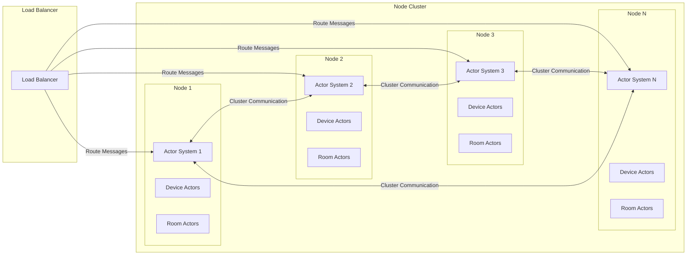
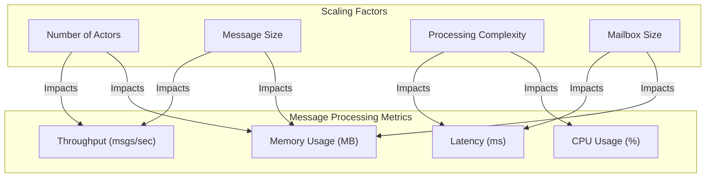

# 9. Scalability and Performance

## Overview

This section describes how the actor-based IoT system scales to handle large numbers of devices and high message throughput while maintaining good performance. Scalability and performance are critical for IoT systems, which may need to handle thousands or millions of devices and process high volumes of messages.

## Actor System Scaling

The actor system can scale horizontally across multiple nodes to handle increasing load. The following diagram illustrates this scaling approach:



## Scaling Strategies

The system uses several strategies to scale effectively:

1. **Horizontal Scaling**: Adding more nodes to the cluster to increase capacity.
2. **Actor Distribution**: Distributing actors across nodes based on load and locality.
3. **Sharding**: Partitioning actors based on a consistent hashing algorithm to ensure even distribution.
4. **Load Balancing**: Distributing incoming messages across nodes to prevent hotspots.
5. **Message Batching**: Batching small messages together to reduce overhead.
6. **Backpressure**: Implementing backpressure mechanisms to handle overload situations.

## Message Processing Performance

The performance of message processing depends on various factors, as illustrated in the following diagram:



## Performance Optimization Techniques

The system uses various techniques to optimize performance:

1. **Efficient Message Passing**: Using efficient serialization and transport mechanisms for message passing.
2. **Mailbox Tuning**: Configuring mailbox sizes and processing strategies based on actor types and workloads.
3. **Actor Pooling**: Using actor pools for stateless actors to reduce creation and destruction overhead.
4. **Message Prioritization**: Prioritizing critical messages to ensure they are processed promptly.
5. **Batching and Aggregation**: Batching and aggregating messages to reduce processing overhead.
6. **Caching**: Caching frequently accessed data to reduce database load.
7. **Asynchronous I/O**: Using asynchronous I/O for external interactions to avoid blocking actor processing.
8. **Resource Limiting**: Implementing resource limits to prevent resource exhaustion.

## Scalability Metrics

The following metrics are used to measure and monitor scalability:

1. **Actor Count**: Number of actors in the system, by type and node.
2. **Message Throughput**: Number of messages processed per second, by type and node.
3. **Message Latency**: Time taken to process messages, by type and priority.
4. **Resource Utilization**: CPU, memory, network, and disk usage, by node.
5. **Mailbox Size**: Size of actor mailboxes, indicating potential bottlenecks.
6. **Error Rate**: Number of errors encountered during message processing.

## Performance Testing

Performance testing is essential to ensure the system meets its scalability and performance requirements. The following types of tests are performed:

1. **Load Testing**: Testing the system under expected load conditions.
2. **Stress Testing**: Testing the system under extreme load conditions to identify breaking points.
3. **Soak Testing**: Testing the system under sustained load over an extended period.
4. **Scalability Testing**: Testing how the system scales as resources are added or removed.
5. **Bottleneck Identification**: Identifying performance bottlenecks through profiling and monitoring.

## Scalability Challenges and Solutions

### Challenge 1: Actor State Management

**Challenge**: As the number of actors grows, managing actor state becomes challenging, especially for stateful actors like device actors.

**Solution**: 
- Implement efficient state storage mechanisms, such as in-memory databases or distributed caches.
- Use state snapshots and event sourcing to reduce memory usage.
- Implement actor passivation to unload inactive actors from memory.

### Challenge 2: Message Routing

**Challenge**: Efficiently routing messages to actors across a distributed cluster.

**Solution**:
- Use consistent hashing to determine actor placement.
- Implement location transparency to hide actor location details from clients.
- Use local caching of actor references to reduce lookup overhead.

### Challenge 3: Network Overhead

**Challenge**: Network communication between nodes adds overhead and can become a bottleneck.

**Solution**:
- Optimize message serialization for efficiency.
- Batch messages when appropriate to reduce network overhead.
- Use compression for large messages.
- Implement locality-aware actor placement to minimize cross-node communication.

### Challenge 4: Resource Contention

**Challenge**: Actors competing for resources can lead to performance degradation.

**Solution**:
- Implement fair scheduling of actor message processing.
- Use priority mailboxes for critical actors.
- Implement resource isolation and limits.
- Monitor and alert on resource contention.

### Challenge 5: Backpressure

**Challenge**: Handling situations where message production exceeds processing capacity.

**Solution**:
- Implement backpressure mechanisms to slow down message producers.
- Use buffering and throttling to handle temporary spikes.
- Implement graceful degradation strategies for overload situations.
- Monitor queue depths and processing latencies to detect backpressure situations.

## Performance Benchmarks

The following table shows performance benchmarks for different actor types and operations:

| Actor Type | Operation | Throughput (msgs/sec) | Latency (ms) | Memory (MB/actor) |
|------------|-----------|----------------------|--------------|-------------------|
| Device Actor | State Update | 10,000 | 5 | 0.5 |
| Device Actor | Command Processing | 5,000 | 10 | 0.5 |
| Room Actor | Message Broadcast | 2,000 | 15 | 1.0 |
| Twin Actor | State Sync | 8,000 | 7 | 0.7 |
| Pipeline Actor | Data Processing | 3,000 | 20 | 1.5 |

## Scaling Guidelines

The following guidelines help determine when and how to scale the system:

1. **When to Scale Out**:
   - When average CPU utilization exceeds 70% across nodes.
   - When message latency exceeds acceptable thresholds.
   - When mailbox sizes consistently grow, indicating processing bottlenecks.

2. **How to Scale Out**:
   - Add nodes to the cluster incrementally.
   - Monitor performance metrics after each scaling operation.
   - Rebalance actors across nodes if necessary.

3. **When to Scale In**:
   - When average CPU utilization falls below 30% across nodes.
   - When resource utilization indicates excess capacity.

4. **How to Scale In**:
   - Gracefully migrate actors from nodes being removed.
   - Remove nodes from the cluster incrementally.
   - Monitor performance metrics after each scaling operation.

## Example: Scaling Configuration

The following example shows how to configure the actor system for scalability:

```go
// Configure actor system for scalability
config := actor.Config{
    Address:     "192.168.1.1",
    Port:        8000,
    ClusterName: "iot-cluster",
}

// Create actor system with optimized settings
actorSystem := actor.NewActorSystem(config, logger)

// Configure dispatcher for device actors
deviceDispatcherConfig := actor.DispatcherConfig{
    Throughput:        100,  // Process up to 100 messages per actor before moving to next actor
    MailboxSize:       1000, // Buffer up to 1000 messages per actor
    MaxConcurrency:    4,    // Process messages for up to 4 actors concurrently
}
actorSystem.RegisterDispatcher("device-dispatcher", deviceDispatcherConfig)

// Configure dispatcher for room actors
roomDispatcherConfig := actor.DispatcherConfig{
    Throughput:        50,   // Process up to 50 messages per actor before moving to next actor
    MailboxSize:       500,  // Buffer up to 500 messages per actor
    MaxConcurrency:    2,    // Process messages for up to 2 actors concurrently
}
actorSystem.RegisterDispatcher("room-dispatcher", roomDispatcherConfig)

// Create device actor with specific dispatcher
props := actor.PropsFromProducer(func() actor.Receiver {
    return NewDeviceActor(deviceID, logger)
}).WithDispatcher("device-dispatcher")

// Spawn device actor with optimized settings
pid := actorSystem.Engine().Spawn(props, deviceID)
```

## Best Practices for Scalability and Performance

1. **Design for Distribution**: Design actors and messages to work effectively in a distributed environment.
2. **Minimize Actor State**: Keep actor state minimal to reduce memory usage and improve scalability.
3. **Optimize Message Size**: Keep messages small to reduce serialization and network overhead.
4. **Use Appropriate Dispatchers**: Configure dispatchers based on actor types and workloads.
5. **Implement Backpressure**: Implement backpressure mechanisms to handle overload situations.
6. **Monitor Performance**: Continuously monitor performance metrics to detect issues early.
7. **Test Scalability**: Regularly test how the system scales under increasing load.
8. **Profile and Optimize**: Profile the system to identify and optimize bottlenecks.
9. **Document Scaling Procedures**: Document procedures for scaling the system up and down.
10. **Automate Scaling**: Implement automated scaling based on performance metrics when possible.

## Conclusion

The actor pattern provides a natural model for building scalable and high-performance IoT systems. By implementing appropriate scaling strategies, optimizing performance, and monitoring key metrics, the system can handle large numbers of devices and high message throughput while maintaining good performance.
