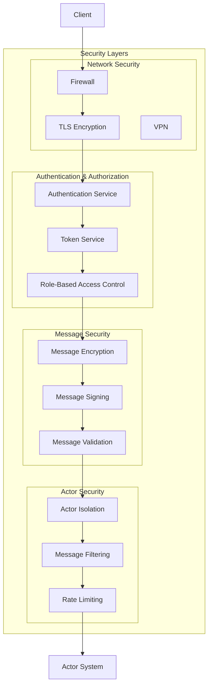
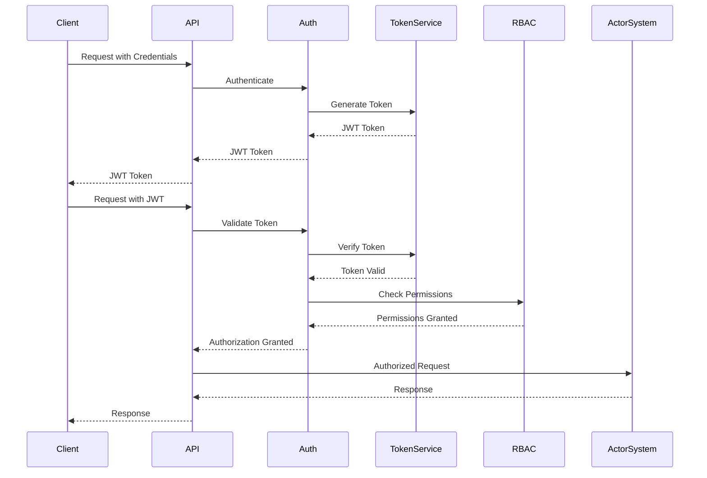
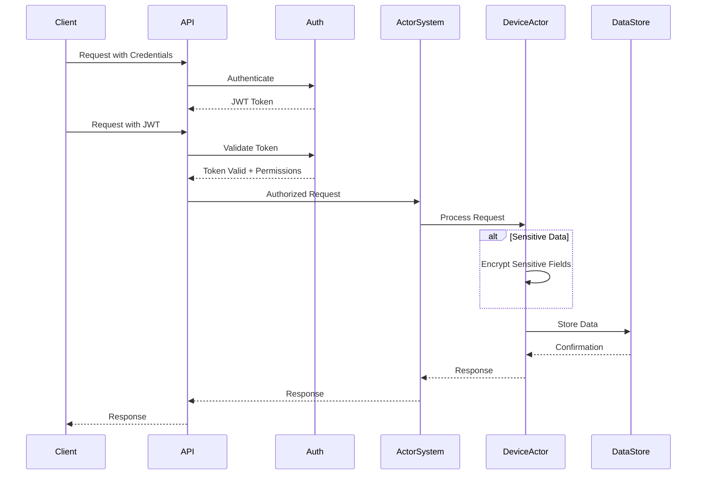
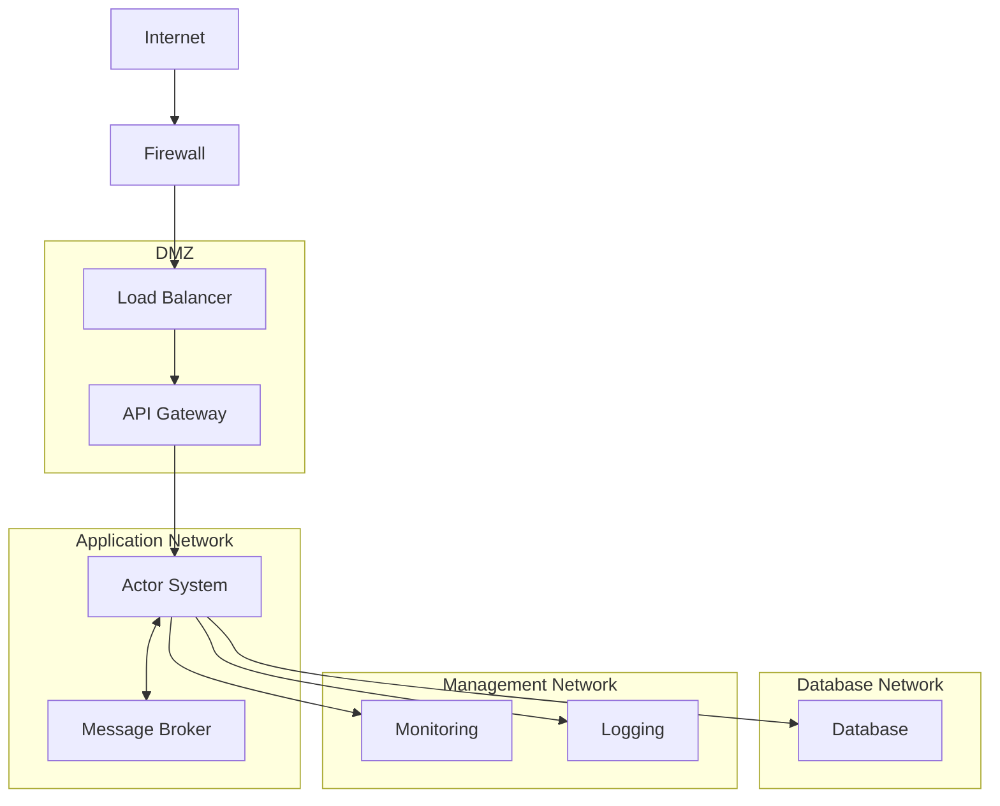
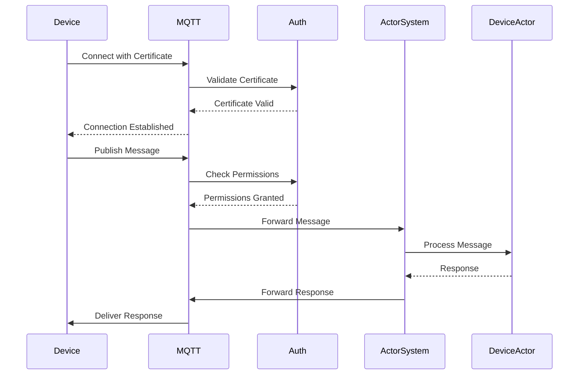

# 11. Security Architecture

## Overview

This section describes the security architecture of the actor-based IoT system, including authentication, authorization, encryption, and other security measures. Security is a critical concern for IoT systems, which often handle sensitive data and control physical devices.

## Actor System Security

The following diagram illustrates the security layers in the actor system:



## Authentication and Authorization

The system uses a comprehensive authentication and authorization framework to control access to resources and operations.

### Authentication

Authentication verifies the identity of users, devices, and services. The system supports multiple authentication methods:

1. **API Key Authentication**: For service-to-service communication.
2. **JWT Authentication**: For user authentication with web and mobile clients.
3. **Certificate Authentication**: For device authentication.
4. **OAuth 2.0**: For integration with external identity providers.

### Authorization

Authorization controls what authenticated entities can do. The system uses role-based access control (RBAC) with the following components:

1. **Roles**: Predefined sets of permissions (e.g., Admin, Operator, User, Device).
2. **Permissions**: Fine-grained access controls for specific operations (e.g., read, write, execute).
3. **Policies**: Rules that determine when permissions are granted or denied.
4. **Scopes**: Limitations on the resources that can be accessed (e.g., specific devices, rooms, or organizations).

### Authentication and Authorization Flow

The following diagram illustrates the authentication and authorization flow:



## Data Protection

The system implements multiple layers of data protection to ensure the confidentiality, integrity, and availability of data.

### Data Classification

Data is classified based on sensitivity:

1. **Public Data**: Information that can be freely shared (e.g., device types, public room names).
2. **Internal Data**: Information that should be restricted to authorized users (e.g., device telemetry, room configurations).
3. **Sensitive Data**: Information that requires special protection (e.g., user credentials, device credentials).
4. **Critical Data**: Information that is essential for system operation and security (e.g., encryption keys, security configurations).

### Data Protection Flow

The following diagram illustrates the data protection flow:



### Encryption

The system uses encryption to protect data:

1. **Transport Encryption**: All network communication is encrypted using TLS.
2. **Message Encryption**: Sensitive message payloads are encrypted using symmetric encryption.
3. **Storage Encryption**: Sensitive data is encrypted before being stored in databases.
4. **Key Management**: Encryption keys are securely managed using a key management service.

## Network Security

The system implements multiple layers of network security to protect against unauthorized access and attacks.

### Network Security Layers

1. **Firewalls**: Control inbound and outbound network traffic based on security rules.
2. **Network Segmentation**: Divide the network into segments with different security requirements.
3. **VPN**: Provide secure remote access to the system.
4. **DDoS Protection**: Protect against distributed denial-of-service attacks.
5. **Intrusion Detection/Prevention**: Detect and prevent network intrusions.

### Network Security Architecture



## Device Security

Securing IoT devices is a critical aspect of the overall security architecture.

### Device Security Measures

1. **Device Authentication**: Devices authenticate using certificates or pre-shared keys.
2. **Secure Boot**: Devices verify the integrity of their firmware during boot.
3. **Secure Updates**: Device firmware is updated securely using signed updates.
4. **Device Isolation**: Devices are isolated from each other to prevent lateral movement.
5. **Monitoring**: Device behavior is monitored for anomalies that might indicate compromise.

### Device Authentication Flow



## Threat Modeling

The system uses threat modeling to identify and mitigate potential security threats.

### STRIDE Threat Model

The STRIDE model is used to categorize threats:

1. **Spoofing**: Impersonating another user or device.
   - Mitigation: Strong authentication mechanisms, including certificates and multi-factor authentication.

2. **Tampering**: Modifying data without authorization.
   - Mitigation: Data integrity checks, digital signatures, and access controls.

3. **Repudiation**: Denying having performed an action.
   - Mitigation: Comprehensive logging and audit trails.

4. **Information Disclosure**: Exposing information to unauthorized parties.
   - Mitigation: Encryption, access controls, and data classification.

5. **Denial of Service**: Preventing legitimate users from accessing the system.
   - Mitigation: Rate limiting, resource quotas, and DDoS protection.

6. **Elevation of Privilege**: Gaining higher privileges than authorized.
   - Mitigation: Principle of least privilege, role-based access control, and regular permission reviews.

### Attack Surface Analysis

The system's attack surface is analyzed to identify potential vulnerabilities:

1. **Network Interfaces**: APIs, message brokers, and other network services.
2. **User Interfaces**: Web interfaces, mobile apps, and command-line tools.
3. **Device Interfaces**: Physical and network interfaces on IoT devices.
4. **Data Storage**: Databases, file systems, and caches.
5. **Third-Party Dependencies**: Libraries, frameworks, and external services.

## Security Monitoring and Incident Response

The system includes comprehensive security monitoring and incident response capabilities.

### Security Monitoring

1. **Log Collection**: Collect logs from all system components.
2. **Security Information and Event Management (SIEM)**: Analyze logs for security events.
3. **Intrusion Detection**: Detect potential intrusions based on network and system behavior.
4. **Vulnerability Scanning**: Regularly scan for vulnerabilities in the system.
5. **Compliance Monitoring**: Monitor compliance with security policies and regulations.

### Incident Response

1. **Incident Detection**: Detect security incidents through monitoring and alerts.
2. **Incident Classification**: Classify incidents based on severity and impact.
3. **Incident Containment**: Contain the incident to prevent further damage.
4. **Incident Eradication**: Remove the cause of the incident.
5. **Incident Recovery**: Restore normal operations.
6. **Post-Incident Analysis**: Analyze the incident to prevent similar incidents in the future.

## Compliance and Regulations

The system is designed to comply with relevant security regulations and standards:

1. **GDPR**: General Data Protection Regulation for protecting personal data.
2. **HIPAA**: Health Insurance Portability and Accountability Act for protecting health information.
3. **PCI DSS**: Payment Card Industry Data Security Standard for protecting payment card data.
4. **ISO 27001**: Information security management standard.
5. **NIST Cybersecurity Framework**: Framework for improving cybersecurity risk management.

## Security Best Practices

The following security best practices are implemented in the system:

1. **Defense in Depth**: Implement multiple layers of security controls.
2. **Principle of Least Privilege**: Grant only the minimum necessary privileges.
3. **Secure by Default**: Configure systems securely by default.
4. **Secure Development Lifecycle**: Integrate security into the development process.
5. **Regular Security Testing**: Conduct regular security testing, including penetration testing.
6. **Security Training**: Provide security training for developers and operators.
7. **Third-Party Security**: Assess and monitor the security of third-party dependencies.
8. **Security Updates**: Promptly apply security updates to all components.
9. **Security Documentation**: Document security controls, configurations, and procedures.
10. **Security Metrics**: Track and report on security metrics to measure effectiveness.

## Example: Securing Actor Communication

The following example shows how to secure communication between actors:

```go
// Configure TLS for actor system
tlsConfig := &tls.Config{
    Certificates:       []tls.Certificate{cert},
    RootCAs:            rootCAs,
    InsecureSkipVerify: false,
    MinVersion:         tls.VersionTLS12,
    CipherSuites:       []uint16{
        tls.TLS_ECDHE_RSA_WITH_AES_256_GCM_SHA384,
        tls.TLS_ECDHE_RSA_WITH_AES_128_GCM_SHA256,
    },
}

// Configure actor system with TLS
config := actor.Config{
    Address:     "192.168.1.1",
    Port:        8000,
    ClusterName: "iot-cluster",
    TLSConfig:   tlsConfig,
}

// Create actor system with security middleware
actorSystem := actor.NewActorSystem(config, logger)

// Add authentication middleware
actorSystem.Use(func(next actor.ReceiverFunc) actor.ReceiverFunc {
    return func(ctx actor.Context) {
        // Authenticate the message sender
        if !authenticate(ctx.Sender(), ctx.Message()) {
            ctx.Respond(errors.New("authentication failed"))
            return
        }
        next(ctx)
    }
})

// Add authorization middleware
actorSystem.Use(func(next actor.ReceiverFunc) actor.ReceiverFunc {
    return func(ctx actor.Context) {
        // Authorize the message sender for the requested operation
        if !authorize(ctx.Sender(), ctx.Self(), ctx.Message()) {
            ctx.Respond(errors.New("authorization failed"))
            return
        }
        next(ctx)
    }
})

// Add encryption middleware
actorSystem.Use(func(next actor.ReceiverFunc) actor.ReceiverFunc {
    return func(ctx actor.Context) {
        // Decrypt the message if it's encrypted
        if msg, ok := ctx.Message().(*message.Message); ok && msg.Encrypted {
            decryptedPayload, err := decrypt(msg.Payload, getKey(ctx.Sender()))
            if err != nil {
                ctx.Respond(err)
                return
            }
            msg.Payload = decryptedPayload
            msg.Encrypted = false
        }
        next(ctx)
    }
})
```

## Conclusion

Security is a critical aspect of the actor-based IoT system. By implementing a comprehensive security architecture that addresses authentication, authorization, data protection, network security, and other security concerns, the system can protect against a wide range of threats while providing the required functionality and performance.
