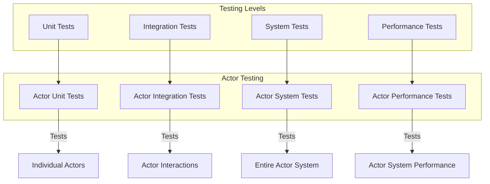
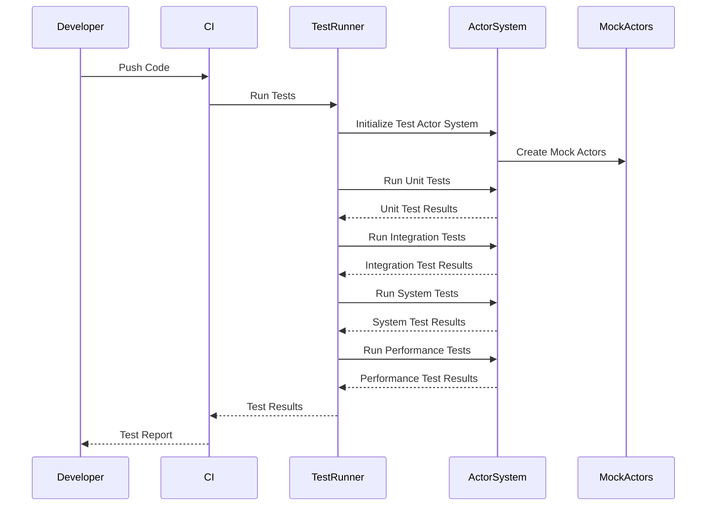

# 12. Testing Strategy

## Overview

This section describes the testing strategy for the actor-based IoT system, including unit testing, integration testing, system testing, and performance testing. A comprehensive testing strategy is essential for ensuring the reliability, correctness, and performance of the system.

## Testing Hierarchy

The testing strategy follows a hierarchical approach, with different types of tests focusing on different aspects of the system:



## Unit Testing

Unit tests focus on testing individual components in isolation, such as actors, services, and repositories.

### Actor Unit Testing

Actor unit testing involves testing the behavior of individual actors in isolation. This is achieved by:

1. **Mocking Dependencies**: Dependencies such as repositories, services, and other actors are mocked.
2. **Simulating Messages**: Messages are simulated and sent to the actor.
3. **Verifying Behavior**: The actor's behavior in response to messages is verified.

Example of an actor unit test:

```go
func TestDeviceActor_HandleCommandMessage(t *testing.T) {
    // Create mock logger
    mockLogger := &mocks.Logger{}
    mockLogger.On("Info", mock.Anything, mock.Anything, mock.Anything).Return()
    mockLogger.On("Debug", mock.Anything, mock.Anything, mock.Anything).Return()
    
    // Create device actor
    deviceID := "device-1"
    actor := NewDeviceActor(deviceID, mockLogger)
    
    // Create mock actor context
    mockContext := &mocks.Context{}
    mockContext.On("Self").Return(&actor.PID{ID: deviceID})
    mockContext.On("Sender").Return(&actor.PID{ID: "sender-1"})
    mockContext.On("Send", mock.Anything, mock.Anything).Return()
    
    // Create command message
    msg := &message.Message{
        ID:      "msg-1",
        Type:    "command",
        Source:  "sender-1",
        Target:  deviceID,
        Payload: []byte(`{"command": "turn_on"}`),
        ReplyTo: &actor.PID{ID: "sender-1"},
    }
    
    // Handle message
    actor.handleCommandMessage(mockContext, msg)
    
    // Verify behavior
    mockContext.AssertCalled(t, "Send", &actor.PID{ID: "sender-1"}, mock.Anything)
    mockLogger.AssertCalled(t, "Debug", "Handling command message", "message_id", "msg-1")
}
```

### Service Unit Testing

Service unit testing involves testing the behavior of services in isolation. This is achieved by:

1. **Mocking Dependencies**: Dependencies such as repositories, actor systems, and other services are mocked.
2. **Simulating Requests**: Requests are simulated and sent to the service.
3. **Verifying Behavior**: The service's behavior in response to requests is verified.

Example of a service unit test:

```go
func TestActorService_StartDeviceActor(t *testing.T) {
    // Create mock dependencies
    mockActorSystem := &mocks.ActorSystem{}
    mockDeviceRepo := &mocks.DeviceRepository{}
    mockRoomRepo := &mocks.RoomRepository{}
    mockLogger := &mocks.Logger{}
    
    // Create service
    service := NewService(mockActorSystem, mockDeviceRepo, mockRoomRepo, mockLogger)
    
    // Create test device
    deviceID := "device-1"
    testDevice := &device.Device{
        ID:     deviceID,
        Name:   "Test Device",
        Type:   "sensor",
        Status: device.StatusOffline,
    }
    
    // Mock repository behavior
    mockDeviceRepo.On("Get", mock.Anything, deviceID).Return(testDevice, nil)
    
    // Mock actor system behavior
    mockPID := &actor.PID{ID: deviceID}
    mockActorSystem.On("SpawnDevice", deviceID).Return(mockPID, nil)
    mockActorSystem.On("Engine").Return(&actor.Engine{})
    
    // Call service method
    err := service.StartDeviceActor(context.Background(), deviceID)
    
    // Verify behavior
    assert.NoError(t, err)
    mockDeviceRepo.AssertCalled(t, "Get", mock.Anything, deviceID)
    mockActorSystem.AssertCalled(t, "SpawnDevice", deviceID)
}
```

### Repository Unit Testing

Repository unit testing involves testing the behavior of repositories in isolation. This is achieved by:

1. **Using In-Memory Databases**: In-memory databases are used for testing repositories.
2. **Simulating Operations**: CRUD operations are simulated and sent to the repository.
3. **Verifying Behavior**: The repository's behavior in response to operations is verified.

Example of a repository unit test:

```go
func TestDeviceRepository_Register(t *testing.T) {
    // Create repository
    repo := memory.NewDeviceRepository()
    
    // Create test device
    deviceID := "device-1"
    testDevice := &device.Device{
        ID:     deviceID,
        Name:   "Test Device",
        Type:   "sensor",
        Status: device.StatusOffline,
    }
    
    // Register device
    err := repo.Register(context.Background(), testDevice)
    
    // Verify behavior
    assert.NoError(t, err)
    
    // Get device
    retrievedDevice, err := repo.Get(context.Background(), deviceID)
    
    // Verify behavior
    assert.NoError(t, err)
    assert.Equal(t, testDevice, retrievedDevice)
}
```

## Integration Testing

Integration tests focus on testing the interaction between components, such as actors, services, and repositories.

### Actor Integration Testing

Actor integration testing involves testing the interaction between actors. This is achieved by:

1. **Using Real Actor System**: A real actor system is used for testing.
2. **Creating Multiple Actors**: Multiple actors are created and allowed to interact.
3. **Simulating Messages**: Messages are simulated and sent to actors.
4. **Verifying Interactions**: The interactions between actors are verified.

Example of an actor integration test:

```go
func TestDeviceAndRoomActorInteraction(t *testing.T) {
    // Create actor system
    actorSystem := actor.NewActorSystem(actor.Config{}, logger)
    
    // Create device actor
    deviceID := "device-1"
    devicePID, err := actorSystem.SpawnDevice(deviceID)
    assert.NoError(t, err)
    
    // Create room actor
    roomID := "room-1"
    roomPID, err := actorSystem.SpawnRoom(roomID)
    assert.NoError(t, err)
    
    // Add device to room
    addDeviceCmd := &actor.AddDeviceCommand{
        DeviceID:  deviceID,
        DevicePID: devicePID,
    }
    resp, err := actorSystem.Engine().Request(roomPID, addDeviceCmd, nil)
    assert.NoError(t, err)
    addDeviceResp, ok := resp.(*actor.AddDeviceResponse)
    assert.True(t, ok)
    assert.True(t, addDeviceResp.Success)
    
    // Send message to room
    msg := &message.Message{
        ID:      "msg-1",
        Type:    "command",
        Source:  "test",
        Target:  roomID,
        Payload: []byte(`{"command": "turn_on"}`),
    }
    actorSystem.Engine().Send(roomPID, msg)
    
    // Wait for message to be processed
    time.Sleep(100 * time.Millisecond)
    
    // Verify device state
    getStateQuery := &actor.GetStateQuery{}
    resp, err = actorSystem.Engine().Request(devicePID, getStateQuery, nil)
    assert.NoError(t, err)
    getStateResp, ok := resp.(*actor.GetStateResponse)
    assert.True(t, ok)
    assert.Equal(t, device.StatusOnline, getStateResp.State.Status)
}
```

### Service Integration Testing

Service integration testing involves testing the interaction between services and their dependencies. This is achieved by:

1. **Using Real Dependencies**: Real dependencies such as repositories and actor systems are used.
2. **Simulating Requests**: Requests are simulated and sent to services.
3. **Verifying Interactions**: The interactions between services and their dependencies are verified.

Example of a service integration test:

```go
func TestActorServiceWithRealDependencies(t *testing.T) {
    // Create real dependencies
    deviceRepo := memory.NewDeviceRepository()
    roomRepo := memory.NewRoomRepository()
    actorSystem := actor.NewActorSystem(actor.Config{}, logger)
    
    // Create service
    service := NewService(actorSystem, deviceRepo, roomRepo, logger)
    
    // Create test device
    deviceID := "device-1"
    testDevice := &device.Device{
        ID:     deviceID,
        Name:   "Test Device",
        Type:   "sensor",
        Status: device.StatusOffline,
    }
    
    // Register device
    err := deviceRepo.Register(context.Background(), testDevice)
    assert.NoError(t, err)
    
    // Start device actor
    err = service.StartDeviceActor(context.Background(), deviceID)
    assert.NoError(t, err)
    
    // Create test room
    roomID := "room-1"
    testRoom := &room.Room{
        ID:      roomID,
        Name:    "Test Room",
        Type:    room.TypeMany2Many,
        Devices: []string{},
    }
    
    // Create room
    err = roomRepo.Create(context.Background(), testRoom)
    assert.NoError(t, err)
    
    // Start room actor
    err = service.StartRoomActor(context.Background(), roomID)
    assert.NoError(t, err)
    
    // Add device to room
    err = service.AddDeviceToRoom(context.Background(), roomID, deviceID)
    assert.NoError(t, err)
    
    // Get room devices
    devices, err := service.GetRoomDevices(context.Background(), roomID)
    assert.NoError(t, err)
    assert.Contains(t, devices, deviceID)
}
```

## System Testing

System tests focus on testing the entire system as a whole, including all components and their interactions.

### End-to-End Testing

End-to-end testing involves testing the system from the user's perspective. This is achieved by:

1. **Using Real System**: A real system is deployed for testing.
2. **Simulating User Interactions**: User interactions are simulated using API calls or UI automation.
3. **Verifying System Behavior**: The system's behavior in response to user interactions is verified.

Example of an end-to-end test:

```go
func TestEndToEndDeviceRegistrationAndControl(t *testing.T) {
    // Create HTTP client
    client := &http.Client{}
    
    // Register device
    deviceID := "device-1"
    registerReq := map[string]interface{}{
        "id":   deviceID,
        "name": "Test Device",
        "type": "sensor",
    }
    registerReqBody, _ := json.Marshal(registerReq)
    registerResp, err := client.Post("http://localhost:8080/api/devices", "application/json", bytes.NewBuffer(registerReqBody))
    assert.NoError(t, err)
    assert.Equal(t, http.StatusCreated, registerResp.StatusCode)
    
    // Create room
    roomID := "room-1"
    createRoomReq := map[string]interface{}{
        "id":   roomID,
        "name": "Test Room",
        "type": "many2many",
    }
    createRoomReqBody, _ := json.Marshal(createRoomReq)
    createRoomResp, err := client.Post("http://localhost:8080/api/rooms", "application/json", bytes.NewBuffer(createRoomReqBody))
    assert.NoError(t, err)
    assert.Equal(t, http.StatusCreated, createRoomResp.StatusCode)
    
    // Add device to room
    addDeviceReq := map[string]interface{}{
        "device_id": deviceID,
    }
    addDeviceReqBody, _ := json.Marshal(addDeviceReq)
    addDeviceResp, err := client.Post(fmt.Sprintf("http://localhost:8080/api/rooms/%s/devices", roomID), "application/json", bytes.NewBuffer(addDeviceReqBody))
    assert.NoError(t, err)
    assert.Equal(t, http.StatusOK, addDeviceResp.StatusCode)
    
    // Send command to device
    commandReq := map[string]interface{}{
        "command": "turn_on",
    }
    commandReqBody, _ := json.Marshal(commandReq)
    commandResp, err := client.Post(fmt.Sprintf("http://localhost:8080/api/devices/%s/commands", deviceID), "application/json", bytes.NewBuffer(commandReqBody))
    assert.NoError(t, err)
    assert.Equal(t, http.StatusOK, commandResp.StatusCode)
    
    // Get device state
    getStateResp, err := client.Get(fmt.Sprintf("http://localhost:8080/api/devices/%s", deviceID))
    assert.NoError(t, err)
    assert.Equal(t, http.StatusOK, getStateResp.StatusCode)
    
    // Parse response
    var deviceState map[string]interface{}
    json.NewDecoder(getStateResp.Body).Decode(&deviceState)
    assert.Equal(t, "online", deviceState["status"])
}
```

### Scenario Testing

Scenario testing involves testing specific scenarios that users might encounter. This is achieved by:

1. **Defining Scenarios**: Specific scenarios are defined based on user stories or use cases.
2. **Implementing Test Cases**: Test cases are implemented for each scenario.
3. **Verifying Scenario Outcomes**: The outcomes of each scenario are verified.

Example of a scenario test:

```go
func TestScenarioRoomAutomation(t *testing.T) {
    // Create HTTP client
    client := &http.Client{}
    
    // Scenario: Room automation based on presence detection
    
    // Step 1: Register presence sensor
    presenceSensorID := "sensor-1"
    registerSensorReq := map[string]interface{}{
        "id":   presenceSensorID,
        "name": "Presence Sensor",
        "type": "presence_sensor",
    }
    registerSensorReqBody, _ := json.Marshal(registerSensorReq)
    registerSensorResp, err := client.Post("http://localhost:8080/api/devices", "application/json", bytes.NewBuffer(registerSensorReqBody))
    assert.NoError(t, err)
    assert.Equal(t, http.StatusCreated, registerSensorResp.StatusCode)
    
    // Step 2: Register light
    lightID := "light-1"
    registerLightReq := map[string]interface{}{
        "id":   lightID,
        "name": "Light",
        "type": "light",
    }
    registerLightReqBody, _ := json.Marshal(registerLightReq)
    registerLightResp, err := client.Post("http://localhost:8080/api/devices", "application/json", bytes.NewBuffer(registerLightReqBody))
    assert.NoError(t, err)
    assert.Equal(t, http.StatusCreated, registerLightResp.StatusCode)
    
    // Step 3: Create room
    roomID := "room-1"
    createRoomReq := map[string]interface{}{
        "id":   roomID,
        "name": "Living Room",
        "type": "many2many",
    }
    createRoomReqBody, _ := json.Marshal(createRoomReq)
    createRoomResp, err := client.Post("http://localhost:8080/api/rooms", "application/json", bytes.NewBuffer(createRoomReqBody))
    assert.NoError(t, err)
    assert.Equal(t, http.StatusCreated, createRoomResp.StatusCode)
    
    // Step 4: Add devices to room
    addSensorReq := map[string]interface{}{
        "device_id": presenceSensorID,
    }
    addSensorReqBody, _ := json.Marshal(addSensorReq)
    addSensorResp, err := client.Post(fmt.Sprintf("http://localhost:8080/api/rooms/%s/devices", roomID), "application/json", bytes.NewBuffer(addSensorReqBody))
    assert.NoError(t, err)
    assert.Equal(t, http.StatusOK, addSensorResp.StatusCode)
    
    addLightReq := map[string]interface{}{
        "device_id": lightID,
    }
    addLightReqBody, _ := json.Marshal(addLightReq)
    addLightResp, err := client.Post(fmt.Sprintf("http://localhost:8080/api/rooms/%s/devices", roomID), "application/json", bytes.NewBuffer(addLightReqBody))
    assert.NoError(t, err)
    assert.Equal(t, http.StatusOK, addLightResp.StatusCode)
    
    // Step 5: Create automation rule
    ruleID := "rule-1"
    createRuleReq := map[string]interface{}{
        "id":        ruleID,
        "name":      "Turn on light when presence detected",
        "room_id":   roomID,
        "condition": map[string]interface{}{
            "device_id": presenceSensorID,
            "property":  "presence",
            "operator":  "==",
            "value":     true,
        },
        "action": map[string]interface{}{
            "device_id": lightID,
            "command":   "turn_on",
        },
    }
    createRuleReqBody, _ := json.Marshal(createRuleReq)
    createRuleResp, err := client.Post("http://localhost:8080/api/rules", "application/json", bytes.NewBuffer(createRuleReqBody))
    assert.NoError(t, err)
    assert.Equal(t, http.StatusCreated, createRuleResp.StatusCode)
    
    // Step 6: Simulate presence detection
    presenceEventReq := map[string]interface{}{
        "device_id": presenceSensorID,
        "type":      "event",
        "payload": map[string]interface{}{
            "presence": true,
        },
    }
    presenceEventReqBody, _ := json.Marshal(presenceEventReq)
    presenceEventResp, err := client.Post("http://localhost:8080/api/events", "application/json", bytes.NewBuffer(presenceEventReqBody))
    assert.NoError(t, err)
    assert.Equal(t, http.StatusOK, presenceEventResp.StatusCode)
    
    // Step 7: Verify light state
    time.Sleep(500 * time.Millisecond) // Wait for automation to execute
    getLightResp, err := client.Get(fmt.Sprintf("http://localhost:8080/api/devices/%s", lightID))
    assert.NoError(t, err)
    assert.Equal(t, http.StatusOK, getLightResp.StatusCode)
    
    // Parse response
    var lightState map[string]interface{}
    json.NewDecoder(getLightResp.Body).Decode(&lightState)
    assert.Equal(t, "on", lightState["state"])
}
```

## Performance Testing

Performance tests focus on testing the system's performance characteristics, such as throughput, latency, and resource utilization.

### Load Testing

Load testing involves testing the system's performance under expected load conditions. This is achieved by:

1. **Defining Load Profiles**: Load profiles are defined based on expected usage patterns.
2. **Generating Load**: Load is generated using load testing tools.
3. **Measuring Performance**: Performance metrics are measured and compared to requirements.

Example of a load test:

```go
func TestLoadDeviceMessageProcessing(t *testing.T) {
    // Create load test configuration
    config := loadtest.Config{
        NumDevices:      1000,
        MessagesPerDevice: 100,
        MessageRate:     1000, // messages per second
        Duration:        60 * time.Second,
    }
    
    // Create load test
    test := loadtest.NewDeviceMessageLoadTest(config)
    
    // Run load test
    results := test.Run()
    
    // Verify performance
    assert.GreaterOrEqual(t, results.Throughput, 900.0) // At least 900 messages per second
    assert.LessOrEqual(t, results.AverageLatency, 100*time.Millisecond) // Less than 100ms average latency
    assert.LessOrEqual(t, results.P95Latency, 200*time.Millisecond) // Less than 200ms 95th percentile latency
    assert.LessOrEqual(t, results.ErrorRate, 0.01) // Less than 1% error rate
}
```

### Stress Testing

Stress testing involves testing the system's performance under extreme load conditions. This is achieved by:

1. **Defining Stress Scenarios**: Stress scenarios are defined to push the system beyond its expected capacity.
2. **Generating Extreme Load**: Extreme load is generated using load testing tools.
3. **Measuring Breaking Points**: The system's breaking points are identified and measured.

Example of a stress test:

```go
func TestStressDeviceMessageProcessing(t *testing.T) {
    // Create stress test configuration
    config := loadtest.Config{
        NumDevices:      10000,
        MessagesPerDevice: 1000,
        MessageRate:     10000, // messages per second
        Duration:        300 * time.Second,
        RampUp:          60 * time.Second,
    }
    
    // Create stress test
    test := loadtest.NewDeviceMessageStressTest(config)
    
    // Run stress test
    results := test.Run()
    
    // Verify system behavior under stress
    assert.LessOrEqual(t, results.ErrorRate, 0.05) // Less than 5% error rate even under stress
    assert.NotNil(t, results.BreakingPoint) // Breaking point should be identified
    assert.GreaterOrEqual(t, results.BreakingPoint.Throughput, 5000.0) // Breaking point should be at least 5000 messages per second
}
```

## Test Execution Flow

The following diagram illustrates the flow of test execution:



## Test Automation

Tests are automated using continuous integration (CI) pipelines. The following steps are performed in the CI pipeline:

1. **Code Checkout**: The code is checked out from the repository.
2. **Build**: The code is built.
3. **Unit Tests**: Unit tests are run.
4. **Integration Tests**: Integration tests are run.
5. **System Tests**: System tests are run.
6. **Performance Tests**: Performance tests are run.
7. **Code Coverage**: Code coverage is measured.
8. **Test Report**: A test report is generated.

## Test Data Management

Test data is managed using the following approaches:

1. **Test Fixtures**: Predefined test data is stored in fixtures.
2. **Data Generators**: Test data is generated dynamically using data generators.
3. **Test Databases**: Separate databases are used for testing.
4. **Data Cleanup**: Test data is cleaned up after tests.

## Test Monitoring and Reporting

Test results are monitored and reported using the following approaches:

1. **Test Dashboards**: Dashboards display test results and trends.
2. **Test Reports**: Detailed test reports are generated for each test run.
3. **Alerts**: Alerts are triggered when tests fail.
4. **Metrics**: Test metrics are collected and analyzed.

## Best Practices for Testing

The following best practices are followed for testing:

1. **Test Early and Often**: Tests are run early and frequently during development.
2. **Automate Tests**: Tests are automated to ensure consistency and repeatability.
3. **Use Test-Driven Development**: Tests are written before code when appropriate.
4. **Maintain Test Independence**: Tests are independent of each other.
5. **Use Realistic Test Data**: Test data is realistic and representative of production data.
6. **Monitor Test Performance**: Test performance is monitored to detect regressions.
7. **Review Test Results**: Test results are reviewed regularly.
8. **Maintain Test Code Quality**: Test code is maintained with the same quality standards as production code.
9. **Document Test Cases**: Test cases are documented to explain their purpose and expected outcomes.
10. **Continuously Improve Tests**: Tests are continuously improved based on feedback and experience.

## Conclusion

A comprehensive testing strategy is essential for ensuring the reliability, correctness, and performance of the actor-based IoT system. By implementing a hierarchical approach to testing, from unit tests to system tests, and by following best practices for test automation, data management, and reporting, the system can be thoroughly tested and validated before deployment to production.
